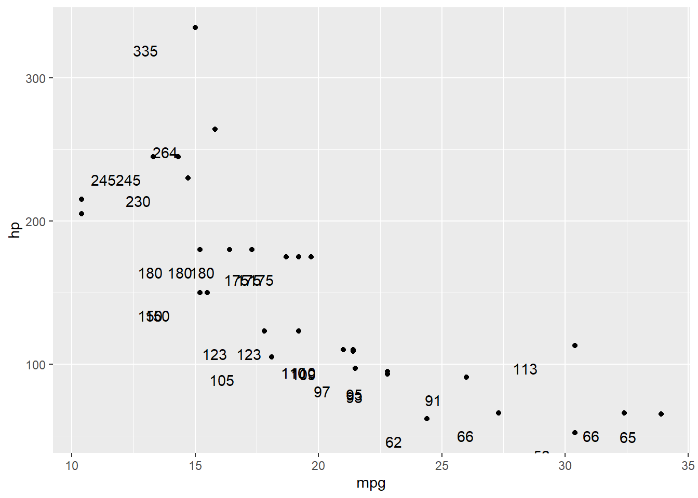

--- 
title: "R Coding Compendium"
author: "Ryan Schneider"
date: "2021-12-30"
site: bookdown::bookdown_site
---

# A Monument to my Madness

This book contains all my personal coding notes from the last two years. Why am I doing this? Probably because I'm a glutton for punishment, and I'd rather procrastinate than write my dissertation proposal.
<<<<<<< HEAD

## What this book is, and what it is not

You know those absolutely amazing, comprehensive guides where you can learn everything you need to know about R? This is is not one of those guides.

This book is designed as a ***quick reference guide*** for many of the most common things you'll need to do in everyday data analysis and research. Think of it like a coding *dictionary*, as opposed to a manual or comprehensive text. 

**If you want (or need) to learn R in-depth and/or from the ground up (i.e., you're a novice user)**, then you should go read [Hadley Wickham's book](https://r4ds.had.co.nz/) and [the tidyverse websites](https://www.tidyverse.org/packages/). Also, [these slides](https://oliviergimenez.github.io/intro_tidyverse/#1) might be a good high-level overview if you've never used the tidyverse before. 

That said, if you're already familiar with R and the tidyverse and just need a quick reference for *"what command do I need to accomplish XYZ"*, you've come to the right place.


<!--chapter:end:index.Rmd-->

# Introduction: R Basics

For the love of God before you do anything, familiarize yourself with R Projects and the `here` package. These make R so much more user friendly and less of a nightmare. If you need an overview, go here: http://jenrichmond.rbind.io/post/how-to-use-the-here-package/


Now lets get stuck in.


```r
library(tidyverse)
```


## Importing Data

### Spreadsheets

See https://nacnudus.github.io/spreadsheet-munging-strategies/index.html for more detailed and in-depth tutorials (if you need that kind of thing)


## Exporting (i.e., saving) Data and Output

### Exporting to .CSV

Generally speaking, unless you have a specific reason to, don't. But if you must: `write_csv()`

### Export to .RData (and load the data again later)


```r
save(obj_name, file=here::here("subfolder", "save_file_name"), compress = FALSE)

load(here::here("folder", "save_name.RData"))
```


### Export to Excel


```r
library(openxlsx)

#Method 1: If you only want to export 1 thing, and/or only need output document
  #write as object, with no formatting:
  write.xlsx(objectname,file = "filenamehere.xlsx",colnames=TRUE, borders="columns")

  #write as table:
  write.xlsx(objectname,"filename.xlsx",asTable = TRUE)


#Method 2: If you want to do the above, but add multiple objects or tables to one workbook/file:
  ## first Create Workbook object
  wb <- createWorkbook("AuthorName")
  #then add worksheets (as many as desired)
  addWorksheet(wb, "worksheetnamehere")
  
#then write the object to the worksheet  
writeData(wb, "test", nameofobjectordataframe, startCol = 2, startRow = 3, rowNames = TRUE)

#save excel file
saveWorkbook(wb, "filenamehere.xlsx", overwrite =TRUE)


#Method 3: exact same as method 2, but creating a more fancy tables

wb <- createWorkbook("Ryan")
addWorksheet(wb, "worksheetnamehere")
writeDataTable(wb, sheetName, objectName, startCol = 1, startRow = 1, colNames = TRUE, rowNames = FALSE,
          tableStyle="TableStyleLight2",tableName=NULL, headerStyle = NULL,withFilter=FALSE,keepNA=TRUE,sep=", ",
          stack = FALSE, firstColumn = FALSE, lastColumn = FALSE,bandedRows = TRUE,bandedCols = FALSE)

saveWorkbook(wb, "filenamehere.xlsx", overwrite =TRUE)
```


### Access/edit specific cell number values


```r
rainbow=tibble::tribble(~Color,
                "red",
                "orange",
                "black",
                "green",
                "blue",
                "purple")

rainbow$Color[3] # access, but can't overwrite this way
```

```
## [1] "black"
```

```r
rainbow[3,"Color"] # access and can overwrite
```

```
## # A tibble: 1 x 1
##   Color
##   <chr>
## 1 black
```

```r
rainbow[3, "Color"]= "yellow" # save this value to row 3 in column "Color"

rainbow
```

```
## # A tibble: 6 x 1
##   Color 
##   <chr> 
## 1 red   
## 2 orange
## 3 yellow
## 4 green 
## 5 blue  
## 6 purple
```


<!--chapter:end:02-basics.Rmd-->

# Wrangle Data

This chapter contains useful tips on wrangling (i.e., manipulating) data. If you need to know to do to things like create new variables, split one variable into multiple variables, pivot a data set from wide to long, etc., look no further.

If you want a pretty good intro tutorial to the `dplyr` package, click [here](https://www-r--bloggers-com.cdn.ampproject.org/v/s/www.r-bloggers.com/2021/01/how-to-analyze-data-with-r-a-complete-beginner-guide-to-dplyr/amp/?amp_js_v=a6&gsa=1&usqp=mq331AQFKAGwASA%3D#csi=0&referrer=https%3A%2F%2Fwww.google.com&tf=From%20%251%24s&ampshare=https%3A%2F%2Fwww.r-bloggers.com%2F2021%2F01%2Fhow-to-analyze-data-with-r-a-complete-beginner-guide-to-dplyr%2F)

## Joining or Splitting

Joining and splitting data is pretty straightforward....

### Whole Data Sets

The code below is from [this excellent tutorial](https://www.youtube.com/watch?v=SCdmyyoudb8&t=23s)


```r
set.seed(2018)

df1=data.frame(customer_id=c(1:10),
               product=sample(c('toaster','TV','Dishwasher'),10,replace = TRUE))


df2=data.frame(customer_id=c(sample(df1$customer_id, 5)),state=sample(c('New York','California'),5,replace = TRUE))

df1=tibble::as_tibble(df1)
df2=tibble::as_tibble(df2)

# df1 =left table
# df2= right table
```

Inner join - retains only rows with values that appear in both tables, and matches by keys.

*If you're joining two Qualtrics surveys together, this is most likely the one you want to use (e.g. matching by participant name, and only keeping rows in the joined data set for participants that have responses logged in both survey 1 and survey 2*

```r
df1 %>% inner_join(df2,by='customer_id')
```

```
## # A tibble: 5 x 3
##   customer_id product    state   
##         <int> <chr>      <chr>   
## 1           1 Dishwasher New York
## 2           3 Dishwasher New York
## 3           6 toaster    New York
## 4           8 Dishwasher New York
## 5           9 Dishwasher New York
```

Left join - returns everything in the left, and rows with matching keys in the right

```r
df1 %>% left_join(df2,by='customer_id')
```

```
## # A tibble: 10 x 3
##    customer_id product    state   
##          <int> <chr>      <chr>   
##  1           1 Dishwasher New York
##  2           2 Dishwasher <NA>    
##  3           3 Dishwasher New York
##  4           4 toaster    <NA>    
##  5           5 TV         <NA>    
##  6           6 toaster    New York
##  7           7 toaster    <NA>    
##  8           8 Dishwasher New York
##  9           9 Dishwasher New York
## 10          10 TV         <NA>
```

Right join - returns everything in the right, and rows with matching keys in the left

```r
df1 %>% right_join(df2,by='customer_id')
```

```
## # A tibble: 5 x 3
##   customer_id product    state   
##         <int> <chr>      <chr>   
## 1           1 Dishwasher New York
## 2           3 Dishwasher New York
## 3           6 toaster    New York
## 4           8 Dishwasher New York
## 5           9 Dishwasher New York
```

```r
# note: example if the customer id column was named something different in the second df
    #df1 %>% left_join(df2,by=c('customer_id'='name2'))
```

Full join - retain all rows from both tables, and join matching keys in both right and left

```r
df1 %>% full_join(df2,by='customer_id')
```

```
## # A tibble: 10 x 3
##    customer_id product    state   
##          <int> <chr>      <chr>   
##  1           1 Dishwasher New York
##  2           2 Dishwasher <NA>    
##  3           3 Dishwasher New York
##  4           4 toaster    <NA>    
##  5           5 TV         <NA>    
##  6           6 toaster    New York
##  7           7 toaster    <NA>    
##  8           8 Dishwasher New York
##  9           9 Dishwasher New York
## 10          10 TV         <NA>
```

Anti join - returns all rows in the left that do not have matching keys in the right

```r
df1 %>% anti_join(df2,by='customer_id')
```

```
## # A tibble: 5 x 2
##   customer_id product   
##         <int> <chr>     
## 1           2 Dishwasher
## 2           4 toaster   
## 3           5 TV        
## 4           7 toaster   
## 5          10 TV
```


### Individual Columns/Variables

Splitting or joining columns is much easier than doing it to whole data sets. You can use `dplyr::separate()` to accomplish the former, and `dplyr::unite()` for the latter.


```r
print("hello")
```

```
## [1] "hello"
```


## Selecting/extracting specific variables

Sometimes when working with a data set, you want to work with a few *specific* variables. For instance, maybe you want to view a graph of only reverse-coded variables (which start with the prefix "r"); or maybe you want to create a subset of your data that has a few specific variables removed. For this you can use `dplyr::select()` and its associated helper commands

`select()` can be thought of as "extract"; it tells R to identify and "extract" a specific variable (or variables)


```r
cars=mtcars

# select one column
cars %>% select(mpg)

# select multiple columns, if they are all next to one another
cars %>% select(mpg:hp)

# select multiple columns by name (when not next to one another) by defining them in a vector
cars %>% select(c(mpg, hp, wt))

# select only variables that start with a certain prefix/character/pattern/etc.
cars %>% select(starts_with("d"))

# ...or columns that end with a certain prefix/etc.
cars %>% select(ends_with("t"))

# ...or contains a certain pattern or string
cars %>% select(contains("se"))

# select ALL OF the variables in a data set that match those of a pre-defined vector
  
  # first define the names in a vector
  vars=c("hp", "drat", "gear", "carb")
  
  #now use helper
  cars %>% select(all_of(vars))
  
# select ANY OF the variables in a pre-defined vector
  
  vars_2=c("hp", "drat", "watermelon", "grilled_cheese") # only the first two will be in the data
  
  cars %>% select(any_of(vars_2)) # only (and all of) the variables actually PRESENT in the data are pulled
  
# select only variables of a certain class or type
  cars %>% select(where(is.numeric))
  cars %>% select(where(is.character))
```


Other examples can be seen on [THIS LINK](https://tidyselect.r-lib.org/reference/language.html) for a simple but detailed guide.


## If-then and Case-when

### If-then
The premise of an if/then or if/else statement is simple: "If condition 1 is satisfied, perform x operation; if not, then do y"


```r
mtcars %>% mutate(power_level=ifelse(mtcars$hp<350, "Low", "High")) %>% head()
```

```
##                    mpg cyl disp  hp drat    wt  qsec vs am gear carb power_level
## Mazda RX4         21.0   6  160 110 3.90 2.620 16.46  0  1    4    4         Low
## Mazda RX4 Wag     21.0   6  160 110 3.90 2.875 17.02  0  1    4    4         Low
## Datsun 710        22.8   4  108  93 3.85 2.320 18.61  1  1    4    1         Low
## Hornet 4 Drive    21.4   6  258 110 3.08 3.215 19.44  1  0    3    1         Low
## Hornet Sportabout 18.7   8  360 175 3.15 3.440 17.02  0  0    3    2         Low
## Valiant           18.1   6  225 105 2.76 3.460 20.22  1  0    3    1         Low
```
This line of code effectively says: if the length in Sepal.Length is >5, set new variable = to "short"; else, set it to "long"


### Case-when

When you have 3+ conditions, it's easier to use case-when. This is a more simple and straightforward approach than nesting multiple if-else commands


```r
My_vector= case_when(
	Condition1 ~ value1,
	Condition2 ~ value2,
	Condition3 ~ value3
	TRUE ~ valueForEverythingElse #catch all for things that don't meet the above conditions
	)
```

Example:

```r
mtcars %>% mutate(size= case_when(cyl==4 ~ "small",
                                  cyl==6 ~ "medium",
                                  cyl==8 ~ "large")) %>% 
  select(c(cyl,size)) %>% head()
```

```
##                   cyl   size
## Mazda RX4           6 medium
## Mazda RX4 Wag       6 medium
## Datsun 710          4  small
## Hornet 4 Drive      6 medium
## Hornet Sportabout   8  large
## Valiant             6 medium
```

## Conditional replacement of values

The following code is useful if you want to replace a value in one column, and the replacement is conditional upon the value in another column.


```r
mpg %>% 
  mutate(across(.cols = c(displ, cty, hwy),
                .fns = ~case_when(cyl == 4L ~ as.numeric(NA),
                                  TRUE ~ as.numeric(.x))))
```

```
## # A tibble: 234 x 11
##    manufacturer model      displ  year   cyl trans      drv     cty   hwy fl    class  
##    <chr>        <chr>      <dbl> <int> <int> <chr>      <chr> <dbl> <dbl> <chr> <chr>  
##  1 audi         a4          NA    1999     4 auto(l5)   f        NA    NA p     compact
##  2 audi         a4          NA    1999     4 manual(m5) f        NA    NA p     compact
##  3 audi         a4          NA    2008     4 manual(m6) f        NA    NA p     compact
##  4 audi         a4          NA    2008     4 auto(av)   f        NA    NA p     compact
##  5 audi         a4           2.8  1999     6 auto(l5)   f        16    26 p     compact
##  6 audi         a4           2.8  1999     6 manual(m5) f        18    26 p     compact
##  7 audi         a4           3.1  2008     6 auto(av)   f        18    27 p     compact
##  8 audi         a4 quattro  NA    1999     4 manual(m5) 4        NA    NA p     compact
##  9 audi         a4 quattro  NA    1999     4 auto(l5)   4        NA    NA p     compact
## 10 audi         a4 quattro  NA    2008     4 manual(m6) 4        NA    NA p     compact
## # ... with 224 more rows
```


```r
test %>% 
  mutate(across(.cols = c(rank),
                .fns = ~case_when(is.na(participant_score) ~ as.numeric(NA),
                                  TRUE ~ as.numeric(.x))))
```


## Merging variables

Sometimes you'll have multiple variables and you want to collapse them into a single variable. The `pmin()` command is useful for this.

```{r3.14}
example_data=tribble(~A,~B,~C,
                     1,NA,NA,
                     2,NA,NA,
                     3,NA,NA,
                     NA,4,NA,
                     NA,5,NA,
                     NA,6,NA,
                     NA,NA,7,
                     NA,NA,8,
                     NA,NA,9)

example_data %>%
  mutate(accept_reject = 
           pmin(A,B,C,na.rm = TRUE))
```


## Apply a function to multiple variables at once

You can either specify each column individually, like above, or tell R to identify columns for you based on their type or their name. This requires adding in one additional verb--either contains() or where() depending on what you want to do.

Two simple examples:


```r
# turn multiple variables into factors
ex_data=dplyr::tribble(~color, ~car,
                       "red", "corvette",
                       "blue", "chevelle",
                       "green", "camaro",
                       "red", "corvette",
                       "green", "chevelle",
                       "yellow", "gto")

dplyr::glimpse(ex_data)
```

```
## Rows: 6
## Columns: 2
## $ color <chr> "red", "blue", "green", "red", "green", "yellow"
## $ car   <chr> "corvette", "chevelle", "camaro", "corvette", "chevelle", "gto"
```

```r
ex_data %>% mutate(across(c(color, car),factor))
```

```
## # A tibble: 6 x 2
##   color  car     
##   <fct>  <fct>   
## 1 red    corvette
## 2 blue   chevelle
## 3 green  camaro  
## 4 red    corvette
## 5 green  chevelle
## 6 yellow gto
```

```r
# round multiple columns to 1 decimal place
mtcars %>% mutate(across(c(disp:qsec),round,1)) %>% head()
```

```
##                    mpg cyl disp  hp drat  wt qsec vs am gear carb
## Mazda RX4         21.0   6  160 110  3.9 2.6 16.5  0  1    4    4
## Mazda RX4 Wag     21.0   6  160 110  3.9 2.9 17.0  0  1    4    4
## Datsun 710        22.8   4  108  93  3.9 2.3 18.6  1  1    4    1
## Hornet 4 Drive    21.4   6  258 110  3.1 3.2 19.4  1  0    3    1
## Hornet Sportabout 18.7   8  360 175  3.1 3.4 17.0  0  0    3    2
## Valiant           18.1   6  225 105  2.8 3.5 20.2  1  0    3    1
```


## Pivoting (i.e., transposing) data

### Condense multiple rows into a single column (pivot wide to long)

Rearranging data like this can make it easier to work with and analyze. Example below from my gradebook for stats (exported from Canvas), with fake names. 

The command structure is as follows:


```r
 pivot_longer( # Transpose LENGTHWISE by....
    cols = everything(), # Taking ALL variable names...
    names_to="variable", # ...and dumping them into this new variable/column
    values_to="missing_count") #...and placing their values in this other new column
```

**NOTE!!!** Pivoting data from wide to long like this expands the number of rows to make a matrix so that (for example, each student now has as a row for each assignment). Therefore, you can only pivot longways (or wide) **ONCE**, otherwise you will make duplicates. 

*If you need to pivot multiple columns, just include all of the columns in one single pivot; do not use two separate, back to back pivot commands.*

Example:


```r
gradebook=tibble::tribble(
  ~Student, ~Homework.1, ~Homework.2, ~Homework.3, ~Homework.4, ~Homework.5, ~Quiz.1, ~Quiz.2, ~Quiz.3, ~Quiz.4, ~Final,
     "Bob",         19L,          0L,          13,          16,          0L,      21,      7L,      15,    17.5,     33,
    "Jane",         17L,         19L,          16,        16.5,         25L,    21.5,     19L,   14.75,     9.5,   39.5,
    "John",         19L,         19L,        14.5,        19.5,         25L,      21,     21L,    18.5,      17,   46.5
  )

head(gradebook)
```

```
## # A tibble: 3 x 11
##   Student Homework.1 Homework.2 Homework.3 Homework.4 Homework.5 Quiz.1 Quiz.2 Quiz.3 Quiz.4 Final
##   <chr>        <int>      <int>      <dbl>      <dbl>      <int>  <dbl>  <int>  <dbl>  <dbl> <dbl>
## 1 Bob             19          0       13         16            0   21        7   15     17.5  33  
## 2 Jane            17         19       16         16.5         25   21.5     19   14.8    9.5  39.5
## 3 John            19         19       14.5       19.5         25   21       21   18.5   17    46.5
```

```r
gradebook=gradebook %>% 
   pivot_longer( # Transpose lengthwise by:
    cols = Homework.1:Final, # Taking these variables
    names_to="Assignment", # ...and dumping them into this new variable, storing them lengthwise
    values_to="Points") #...then place their values in this new column

gradebook %>% head()
```

```
## # A tibble: 6 x 3
##   Student Assignment Points
##   <chr>   <chr>       <dbl>
## 1 Bob     Homework.1     19
## 2 Bob     Homework.2      0
## 3 Bob     Homework.3     13
## 4 Bob     Homework.4     16
## 5 Bob     Homework.5      0
## 6 Bob     Quiz.1         21
```


## Managing Many Models

Imagine the concept of Russian Dolls, applied to data sets. You can manage data sets more effectively my collapsing them into a single tiny, mini data frame, and stuffing that inside of another one.

This is done via "nesting"...

Effectively, you smush/collapse everything down so it fits inside one column. You can unnest to expand this data back out later when you need it, and keep it collapsed when you don't. Code works like this:


```r
by_country=gapminder::gapminder %>% 
  group_by(continent,country) %>% # indicate the variables to keep at the top level
  nest() # smush the rest into a list-column


country_model=function(df){
  lm(lifExp~year1950,data = df)
}

# Transform a list of models into a df
models=by_country %>% 
  mutate(mod=map(data,country_model))
```

- You can store anything in a data frame. You can keep the df connected to the model, which makes it very easy to manage a whole slew of related models
- You can use functional programming (i.e., iterative functions) to map functions or combinations of functions in new ways.
- Converting data into tidy data sets gives you a whole new way (and easier way) to manage lots of information

Below is the full script I copied from Hadley Wickham's lecture, which you can watch [here](https://www.youtube.com/watch?v=rz3_FDVt9eg)


```r
pacman::p_load(dplyr,purrr,tidyverse,gapminder)

#### Workflow for managing many models in R ####
# 1. Nest data with {tidyr}
# 2. Use {purrr} to map a modeling function
# 3. Use {broom} to inspect your tidy data


gapminder=gapminder %>% 
  mutate(year1950= year-1950) #the number of years it's been since 1950

#--------------------------------------------------------------------------------------------
#### Step 1. Nest the data. ####

# A nested data frame has one column per country. You're essentially 
# creating a Russian doll; a data frame inside of a larger data frame.

by_country=gapminder %>% 
  group_by(continent,country) %>% # variables to keep at the top level
  nest() # smush everything else into a df, and store this mini-df in its own column

# with this, you can have an entire table per row; a whole data frame for each country
# Essentially condensing a list into a table
by_country$data[[1]]


#--------------------------------------------------------------------------------------------

#### Step 2. Use purrr to map stuff. ####

# 12:50
country_model=function(df){
  lm(lifeExp ~ year1950, data = df)
}

models= by_country %>% 
  mutate(
    mod=map(data,country_model)
  )


gapminder %>% 
  group_by(continent,country) %>% 
  nest() %>% 
  mutate(
    mod= data %>% map(country_model)
  )

# 27:11

#--------------------------------------------------------------------------------------------
##### Step 3. ####

# This creates another nested df inside of your main data frame that has the summary stats of each model
models=models %>% mutate(
  tidy=map(mod, broom::tidy), # tidy() gives model estimates
  glance=map(mod,broom::glance), # glance() gives model summaries
  augment=map(mod,broom::augment) # model coefficients
)

# What can you do with this nest of data frames? 
# The reverse of step 1; un-nest it to unpack everything!
# 34:40
# Keeps a massive list of related information neatly organized!

unnest(models,data) # back to where we started
unnest(models,glance, .drop = TRUE) 
unnest(models,tidy) 
```

...and here is a version I made of the above to manage many Bayesian models. Admittedly, I'm not really sure how useful this is though.


```r
# CONDENSED MASTER TABLE VERSION -----------------------------------------------------------------------------
# Models table that has all models condensed

models=tribble(~Model_name, ~model_descrip, ~model,
               "Thesis_Model", "Discount and PTS", Thesis_Model,
               "discount_model", "Discount variable only", discount_model,
               "PTS_model", "PTS variable only", PTS_model
)

# Clean up work space
#rm(DiscountPrior,Priors_MEmodel,Priors_Interactionmodel)

# Grab and store all model info 
models=models %>% 
  mutate(prior_info=map(model,describe_prior),
         posterior_info=map(model, describe_posterior_fancy),
         model_performance=map(model,performance::performance)
         
  )

# DO NOT TRY AND VIEW THE TABLE IN A WINDOW!!!! RStan objects are so large they cause R to lock up
# Call the model in the console instead

#### summon individual model stats ####
describe_prior(models$model[[1]]) #by specific model
map(models$model,describe_prior) # do for all models at once

# or all info for all models at once
unnest(models,posterior_info) %>% 
  select(-c(model,prior_info,model_descrip))
```


## Turn row names into a column/variable

Use the `rownames()` command to turn row names into a variable


```r
cars=rownames_to_column(mtcars, var = "car")

as_tibble(cars) %>% slice(1:6)
```

```
## # A tibble: 6 x 12
##   car                 mpg   cyl  disp    hp  drat    wt  qsec    vs    am  gear  carb
##   <chr>             <dbl> <dbl> <dbl> <dbl> <dbl> <dbl> <dbl> <dbl> <dbl> <dbl> <dbl>
## 1 Mazda RX4          21       6   160   110  3.9   2.62  16.5     0     1     4     4
## 2 Mazda RX4 Wag      21       6   160   110  3.9   2.88  17.0     0     1     4     4
## 3 Datsun 710         22.8     4   108    93  3.85  2.32  18.6     1     1     4     1
## 4 Hornet 4 Drive     21.4     6   258   110  3.08  3.22  19.4     1     0     3     1
## 5 Hornet Sportabout  18.7     8   360   175  3.15  3.44  17.0     0     0     3     2
## 6 Valiant            18.1     6   225   105  2.76  3.46  20.2     1     0     3     1
```

## How to edit/change column names

TWO WAYS TO DO THIS: Use `colnames()` (for base R) or `rename()` (for tidyverse)

`colnames()` pulls up all the column/variable names as a vector. If you want to actually change them, you'll need to combine this command with something like the sub() or gsub() commands (for base R). I'm going to skip this because...its base R.

To access and change the names faster via tidyverse, run use `rename()`

```r
rm(list=ls()) # clear R's memory

iris %>% rename("hurr"="Sepal.Length",
                "durr"="Sepal.Width",
                "abcdefgh"="Species") %>% 
  head()
```

```
##   hurr durr Petal.Length Petal.Width abcdefgh
## 1  5.1  3.5          1.4         0.2   setosa
## 2  4.9  3.0          1.4         0.2   setosa
## 3  4.7  3.2          1.3         0.2   setosa
## 4  4.6  3.1          1.5         0.2   setosa
## 5  5.0  3.6          1.4         0.2   setosa
## 6  5.4  3.9          1.7         0.4   setosa
```


If you need to do some really fancy conditional renaming (e.g., changing all variables that start with "r" to start with "rf" instead, to make it more clear that the prefix actually stands for "risk factor" rather than "reverse coded"), you'll need to use `rename_with()`. 

This command has two parts to it: the data set, and the function you wish to apply to it (which you put after the `~`)


```r
rename_with(iris, ~ gsub(pattern = ".", replacement = "_", .x, fixed = TRUE)) %>% 
  head()
```

```
##   Sepal_Length Sepal_Width Petal_Length Petal_Width Species
## 1          5.1         3.5          1.4         0.2  setosa
## 2          4.9         3.0          1.4         0.2  setosa
## 3          4.7         3.2          1.3         0.2  setosa
## 4          4.6         3.1          1.5         0.2  setosa
## 5          5.0         3.6          1.4         0.2  setosa
## 6          5.4         3.9          1.7         0.4  setosa
```

The gsub() function from Base R identifies matching patterns in the data and substitutes them with what you want instead. Think of it like R's version of Find/Replace from Microsoft Word.

The above line of code thus does the following:
	1. First, it checks the column names of the supplied data set (`iris`) for a specific pattern (specified in `pattern=` )
	2. Then it replaces that pattern with your input in `replacement=`

The great thing about rename_with() is that the .fn (or `~` for short) can take *ANY* function as input. For example, if you want to **add** an element to the column names rather than replace something, (e.g., a prefix or suffix), you can change the function to:


```r
rename_with( iris, ~ paste0(.x,  "_text")) %>% 
  head()
```

```
##   Sepal.Length_text Sepal.Width_text Petal.Length_text Petal.Width_text Species_text
## 1               5.1              3.5               1.4              0.2       setosa
## 2               4.9              3.0               1.4              0.2       setosa
## 3               4.7              3.2               1.3              0.2       setosa
## 4               4.6              3.1               1.5              0.2       setosa
## 5               5.0              3.6               1.4              0.2       setosa
## 6               5.4              3.9               1.7              0.4       setosa
```

The above line adds a suffix. You can also add a prefix in the exact same way, just by switching the order of the string and the pattern in the paste0 command.


***Alternative method to the above***
This is a second way to do the above. It may appear more simple, but it's also probably not as theoretically consistent with how the packages were made…..it uses the `stringr` package to rename the column names, and `stringr` is typically used for editing vectors of strings in a data set.

…so it works, but it's a little unconventional because you call and edit the column names like you would a variable in your data set.


```r
colnames(iris)=str_replace(colnames(iris), pattern = ".", replacement = "_")
```

In short: `rename()` and `rename_with()` are for *renaming* variables, as their names imply. The `str_` verbs from the stringr package are for editing string-based variabels in your data set. Either works though with a little ingenuity.


## Re-order columns in a data set

Use `relocate()` to change column positions. If you need to move multiple columns at once, this command uses the same syntax as `select()`.


```r
mtcars # notice the column order
```

```
##                      mpg cyl  disp  hp drat    wt  qsec vs am gear carb
## Mazda RX4           21.0   6 160.0 110 3.90 2.620 16.46  0  1    4    4
## Mazda RX4 Wag       21.0   6 160.0 110 3.90 2.875 17.02  0  1    4    4
## Datsun 710          22.8   4 108.0  93 3.85 2.320 18.61  1  1    4    1
## Hornet 4 Drive      21.4   6 258.0 110 3.08 3.215 19.44  1  0    3    1
## Hornet Sportabout   18.7   8 360.0 175 3.15 3.440 17.02  0  0    3    2
## Valiant             18.1   6 225.0 105 2.76 3.460 20.22  1  0    3    1
## Duster 360          14.3   8 360.0 245 3.21 3.570 15.84  0  0    3    4
## Merc 240D           24.4   4 146.7  62 3.69 3.190 20.00  1  0    4    2
## Merc 230            22.8   4 140.8  95 3.92 3.150 22.90  1  0    4    2
## Merc 280            19.2   6 167.6 123 3.92 3.440 18.30  1  0    4    4
## Merc 280C           17.8   6 167.6 123 3.92 3.440 18.90  1  0    4    4
## Merc 450SE          16.4   8 275.8 180 3.07 4.070 17.40  0  0    3    3
## Merc 450SL          17.3   8 275.8 180 3.07 3.730 17.60  0  0    3    3
## Merc 450SLC         15.2   8 275.8 180 3.07 3.780 18.00  0  0    3    3
## Cadillac Fleetwood  10.4   8 472.0 205 2.93 5.250 17.98  0  0    3    4
## Lincoln Continental 10.4   8 460.0 215 3.00 5.424 17.82  0  0    3    4
## Chrysler Imperial   14.7   8 440.0 230 3.23 5.345 17.42  0  0    3    4
## Fiat 128            32.4   4  78.7  66 4.08 2.200 19.47  1  1    4    1
## Honda Civic         30.4   4  75.7  52 4.93 1.615 18.52  1  1    4    2
## Toyota Corolla      33.9   4  71.1  65 4.22 1.835 19.90  1  1    4    1
## Toyota Corona       21.5   4 120.1  97 3.70 2.465 20.01  1  0    3    1
## Dodge Challenger    15.5   8 318.0 150 2.76 3.520 16.87  0  0    3    2
## AMC Javelin         15.2   8 304.0 150 3.15 3.435 17.30  0  0    3    2
## Camaro Z28          13.3   8 350.0 245 3.73 3.840 15.41  0  0    3    4
## Pontiac Firebird    19.2   8 400.0 175 3.08 3.845 17.05  0  0    3    2
## Fiat X1-9           27.3   4  79.0  66 4.08 1.935 18.90  1  1    4    1
## Porsche 914-2       26.0   4 120.3  91 4.43 2.140 16.70  0  1    5    2
## Lotus Europa        30.4   4  95.1 113 3.77 1.513 16.90  1  1    5    2
## Ford Pantera L      15.8   8 351.0 264 4.22 3.170 14.50  0  1    5    4
## Ferrari Dino        19.7   6 145.0 175 3.62 2.770 15.50  0  1    5    6
## Maserati Bora       15.0   8 301.0 335 3.54 3.570 14.60  0  1    5    8
## Volvo 142E          21.4   4 121.0 109 4.11 2.780 18.60  1  1    4    2
```

```r
mtcars %>% relocate(hp:wt, .after= am) %>% head()
```

```
##                    mpg cyl disp  qsec vs am  hp drat    wt gear carb
## Mazda RX4         21.0   6  160 16.46  0  1 110 3.90 2.620    4    4
## Mazda RX4 Wag     21.0   6  160 17.02  0  1 110 3.90 2.875    4    4
## Datsun 710        22.8   4  108 18.61  1  1  93 3.85 2.320    4    1
## Hornet 4 Drive    21.4   6  258 19.44  1  0 110 3.08 3.215    3    1
## Hornet Sportabout 18.7   8  360 17.02  0  0 175 3.15 3.440    3    2
## Valiant           18.1   6  225 20.22  1  0 105 2.76 3.460    3    1
```


## Working with date and time variables

### Format date-and-time variables appropriate as date objects in R

Formatting a column of dates can be extremely helpful if you need to work with time data, but also an extreme pain in the ass. It requires things to be done in two stages, and very precisely. Particularly in the first stage.

First, assuming your data is already imported and is being stored as a vector of character strings, you have to tell R to adjust the formatting of dates. You cannot change it from a character-based object into a Date or DateTime one until it recognizes the correct formatting.


```r
example_date_data=tibble::tribble(~X1,     ~X2,
                                  "8/4/2021",  -49.87,
                                  "8/4/2021",  -13.85,
                                  "8/3/2021",   -7.45,
                                  "8/3/2021", -172.71,
                                  "8/2/2021",   -6.37,
                                  "8/2/2021",     -25,
                                  "8/2/2021", -219.68,
                                  "8/2/2021",  -53.75,
                                  "8/2/2021",  -29.83,
                                  "8/2/2021",  -77.06,
                                  "8/2/2021",  -16.16,
                                  "8/2/2021", -114.78,
                                  "8/2/2021",     -50,
                                  "8/2/2021", -157.64)


# Correct formatting
example_date_data$X1=format(as.POSIXct(example_date_data$X1,format='%m/%d/%Y'),format='%Y-%m-%d')

head(as_tibble(example_date_data))
```

```
## # A tibble: 6 x 2
##   X1              X2
##   <chr>        <dbl>
## 1 2021-08-04  -49.9 
## 2 2021-08-04  -13.8 
## 3 2021-08-03   -7.45
## 4 2021-08-03 -173.  
## 5 2021-08-02   -6.37
## 6 2021-08-02  -25
```

In the code above, note that there are two `format` commands: The first one tells R how the date data is **currently being stored**, while the second at the end tells it how **you want it to be stored.** In this case, we are changing it from the way we would usually hand write a date (e.g., 10/26/1993) to a format commonly recognized and used in Excel and stats software (1993-10-26). *If your column also has times in it, you also need to include that too!*

Second, you can now correct the object's structure. You can do this with base R's `as.Date()` or tidyverse's `date()` verbs.


```r
# Correct structure
example_date_data$X1= lubridate::date(example_date_data$X1) # tidyverse

# Base R version
# example_date_data$X1=as.Date(example_date_data$X1)

head(as_tibble(example_date_data))
```

```
## # A tibble: 6 x 2
##   X1              X2
##   <date>       <dbl>
## 1 2021-08-04  -49.9 
## 2 2021-08-04  -13.8 
## 3 2021-08-03   -7.45
## 4 2021-08-03 -173.  
## 5 2021-08-02   -6.37
## 6 2021-08-02  -25
```

Notice how the object is now stored as the correct type in the table above.

***NOTE!*** This entire process has been included in the `tidy_date()` command in my package, `legaldmlab`.

### Find the difference between two dates/times

```r
difftime(part_1$end_date[1], part_2$end_date[1], units="days")
```


## Reverse-code a variable

To reverse-score a variable, you should use `car::recode()`
Can be done a few different ways, depending on how many variables you're looking to recode:


```r
# Recode just one variable
df$column=recode(df$column,"1 = 7 ; 2 = 6 ; 3 = 5 ; 5 = 3 ; 6 = 2 ; 7 = 1")

# Recode a select bunch of variables
df=df %>% mutate(across(c(family_close : family_feelings), recode, "1 = 7 ; 2 = 6 ; 3 = 5 ; 5 = 3 ; 6 = 2 ; 7 = 1"))

# Recode the whole damn thing. All columns.
df=df %>% map_df(recode, "1 = 7 ; 2 = 6 ; 3 = 5 ; 5 = 3 ; 6 = 2 ; 7 = 1")
```

## Create a relative ranking among several variables

If you want to create a variable that is an ordinal ranking of other variables, first you need to make sure your data is long-wise. Then, depending on the type of ranking system you want, you'll might need a different ranking command....

- The `min_rank` command from dplyr works in a manner similar to base R's `rank` command. It ranks things like you see in sporting events. For example, if there is a clear winner in a game but 3 people tie for second place, the ranks would look like this: 1,2,2,2,4,5. Notice that the positions are independent from the counts.

- Using the same example from above, if you want the ranks to have no gaps (i.e. 1,2,2,2,3,4), you need to use dplyr's `dense_rank` command.

- In either case, the ranks are generated from lowest to highest, so if you want to flip them around you'll need to include `desc()` in the command.


```r
dat=tibble::tribble(~name, ~score,
                    "bob", 0,
                    "bob", 5,
                    "bob", 50,
                    "bob", 50,
                    "bob", 50,
                    "bob", NA,
                    "alice", 70,
                    "alice", 80,
                    "alice", 90,
                    "alice", 20,
                    "alice", 20,
                    "alice", 1)

dat %>% mutate(ranked = dense_rank(desc(score)))
```

```
## # A tibble: 12 x 3
##    name  score ranked
##    <chr> <dbl>  <int>
##  1 bob       0      8
##  2 bob       5      6
##  3 bob      50      4
##  4 bob      50      4
##  5 bob      50      4
##  6 bob      NA     NA
##  7 alice    70      3
##  8 alice    80      2
##  9 alice    90      1
## 10 alice    20      5
## 11 alice    20      5
## 12 alice     1      7
```


<!--chapter:end:03-wrangle.Rmd-->

# Clean Data

## Replace a value with NA

Use `dplyr::na_if()` if you have a value coded in your data (e.g., 999) that you want to convert to NA


```r
example_data=dplyr::tribble(~name, ~bday_month,
                            "Ryan", 10,
                            "Z", 3,
                            "Jen", 999, 
                            "Tristin", 999,
                            "Cassidy", 6)

example_data
```

```
## # A tibble: 5 x 2
##   name    bday_month
##   <chr>        <dbl>
## 1 Ryan            10
## 2 Z                3
## 3 Jen            999
## 4 Tristin        999
## 5 Cassidy          6
```

```r
example_data$bday_month=na_if(example_data$bday_month, 999) #example doing one column at a time 

example_data
```

```
## # A tibble: 5 x 2
##   name    bday_month
##   <chr>        <dbl>
## 1 Ryan            10
## 2 Z                3
## 3 Jen             NA
## 4 Tristin         NA
## 5 Cassidy          6
```

```r
example_data %>% # can also pass the data to mutate and do it the tidyverse way
  mutate(bday_month=na_if(bday_month, 999)) 
```

```
## # A tibble: 5 x 2
##   name    bday_month
##   <chr>        <dbl>
## 1 Ryan            10
## 2 Z                3
## 3 Jen             NA
## 4 Tristin         NA
## 5 Cassidy          6
```


## Replace NA's with a value

`tidyr::replace_na()` is very useful if you have some NA's in your data and you want to fill them in with some value.


```r
example_data=tibble::tribble(~name, ~fav_color, ~fav_food,
                             "Ryan", "green", "Mexican",
                             "Cassidy", "blue", NA,
                             "Z", NA, NA,
                             "Tristin", "purple", NA,
                             "Tarika", NA, NA,
                             "Jen", NA, "Italian")

example_data
```

```
## # A tibble: 6 x 3
##   name    fav_color fav_food
##   <chr>   <chr>     <chr>   
## 1 Ryan    green     Mexican 
## 2 Cassidy blue      <NA>    
## 3 Z       <NA>      <NA>    
## 4 Tristin purple    <NA>    
## 5 Tarika  <NA>      <NA>    
## 6 Jen     <NA>      Italian
```

```r
# replace NA's in one col
tidyr::replace_na(example_data$fav_food, "MISSING")
```

```
## [1] "Mexican" "MISSING" "MISSING" "MISSING" "MISSING" "Italian"
```

```r
# replace in multiple columns
example_data %>% mutate(across(c(fav_color, fav_food), replace_na, "MISSING"))
```

```
## # A tibble: 6 x 3
##   name    fav_color fav_food
##   <chr>   <chr>     <chr>   
## 1 Ryan    green     Mexican 
## 2 Cassidy blue      MISSING 
## 3 Z       MISSING   MISSING 
## 4 Tristin purple    MISSING 
## 5 Tarika  MISSING   MISSING 
## 6 Jen     MISSING   Italian
```


## Identify columns or rows with Missing values

`is.na()` is the base R way to identify, in a TRUE/FALSE manner, whether or not there are missing values in a vector


```r
y <- c(1,2,3,NA)

is.na(y) # returns a vector (F F F T)
```

```
## [1] FALSE FALSE FALSE  TRUE
```


## Find the percentage of a variable that is missing

Sometimes necessary to check before conducting an analysis. *This requires my package*, `legaldmlab`


```r
?legaldmlab::count_missing

mtcars %>% 
  select(hp:drat) %>% 
  legaldmlab::count_missing()
```

```
## # A tibble: 2 x 3
##   variable missing_count percent_missing
##   <chr>            <int> <chr>          
## 1 hp                   0 0.0%           
## 2 drat                 0 0.0%
```


## Exclude Missing values from analysis


# Dropping Missing values from the data set

`tidyr::drop_na()`


```r
example_data=dplyr::tribble(~name, ~bday_month, ~car,
                            "Ryan", 10, "kia",
                            "Z", NA, "toyota",
                            "Jen", NA, NA,
                            "Tristin", 999, NA,
                            "Cassidy", 6, "honda")


example_data
```

```
## # A tibble: 5 x 3
##   name    bday_month car   
##   <chr>        <dbl> <chr> 
## 1 Ryan            10 kia   
## 2 Z               NA toyota
## 3 Jen             NA <NA>  
## 4 Tristin        999 <NA>  
## 5 Cassidy          6 honda
```

```r
example_data %>% drop_na() # with nothing specified, it drops ALL variables that have >=1 missing value
```

```
## # A tibble: 2 x 3
##   name    bday_month car  
##   <chr>        <dbl> <chr>
## 1 Ryan            10 kia  
## 2 Cassidy          6 honda
```

```r
example_data %>% drop_na(car) # drops only rows with values missing in the specified column
```

```
## # A tibble: 3 x 3
##   name    bday_month car   
##   <chr>        <dbl> <chr> 
## 1 Ryan            10 kia   
## 2 Z               NA toyota
## 3 Cassidy          6 honda
```


<!--chapter:end:04-clean.Rmd-->

# Working with Factors


## Manually recode/change a factor's levels

Use `forcats::fct_recode()`


```r
diamonds=diamonds %>% as_tibble()

diamonds$cut=fct_recode(diamonds$cut, "meh"="Fair", "Wow"="Premium")

summary(diamonds$cut)
```

```
##       meh      Good Very Good       Wow     Ideal 
##      1610      4906     12082     13791     21551
```

## Collapse factor levels

Extremely useful command for when you have infrequent cases in one factor and need to combine it with another.

Works by specifying a series of new level names, each of which contains the information from the old variables. Format is as follows:

```r
fct_collapse(dataset$variable,
			NewLevelA=c("OldLevel1","Oldlevel2"), # NewLevelA is the new variable that contains both variables 1 and 2
			NewLevelB=c("OldLevel3"))
```
			

## Add levels to a factor

use `fct_expand()`


```r
print("temp")
```

```
## [1] "temp"
```


## Drop unused levels

Use `fct_drop()`

```r
print("temp")
```

```
## [1] "temp"
```


## Change the order of a factor's levels


```r
example_data=tribble(~person, ~condition,
                     "bob", "25 years",
                     "jane", "5 years",
                     "jim", "5 years",
                     "john", "25 years")

example_data$condition=factor(example_data$condition)

str(example_data$condition)
```

```
##  Factor w/ 2 levels "25 years","5 years": 1 2 2 1
```

Notice that R thinks these are nominal factors, and that 25 comes before 5. To fix this and correct the level order...


```r
example_data$condition =fct_relevel(example_data$condition, c("5 years", "25 years")) # specify level order

str(example_data$condition)
```

```
##  Factor w/ 2 levels "5 years","25 years": 2 1 1 2
```


<!--chapter:end:05-factors.Rmd-->

# Working with Strings


## Remove a pattern from a string


```r
price_table=tribble(~car, ~price,
        "Corvette", "$65,000",
        "Mustang GT", "$40,000")

# BASE R METHOD (sub by replacing something with nothing)
gsub("\\$", "",price_table$price) # (pattern, replace with, object$column)
```

```
## [1] "65,000" "40,000"
```

```r
# TIDYVERSE METHOD
str_remove(price_table$price, pattern = "\\$")
```

```
## [1] "65,000" "40,000"
```


## Replace one pattern in a string with another

Tidyverse command: `str_replace()`
Base R command: `gsub()`


```r
# base R
gsub(mtcars, replacement = )

#tidyverse
```


## Find (i.e., filter for) all instances of a string

Useful for finding very specific things inside a column (e.g., one particular person's name in a roster of names; everyone with a particular last name)

Tidyverse command: `str_detect()`
Base R command: `grepl()`

Note both must be nested inside of `filter()`

```r
cars_df=rownames_to_column(mtcars, var = "car")

# base R
cars_df |> filter(grepl("Firebird", car))

# tidyverse
cars_df %>% filter(str_detect(car,"Firebird"))
```

You can also search for **multiple strings simultaneously** by including the "or" logical operator *inside* the quotes.


```r
cars_df |> filter(str_detect(car, "Firebird|Fiat"))
```

You can also include the negation logical operator to filter for all instances *except* those with the specified string.


```r
# base R
cars_df |> filter(!(grepl("Pontiac", car)))

# tidyverse
cars_df |> filter(!(str_detect(car, "Pontiac")))
```


## Force all letters to lower case

Use `str_to_lower()`


```r
blah=tribble(~A, ~B,
             "A","X",
             "A","X")

blah
```

```
## # A tibble: 2 x 2
##   A     B    
##   <chr> <chr>
## 1 A     X    
## 2 A     X
```

```r
blah$A=str_to_lower(blah$A)

blah
```

```
## # A tibble: 2 x 2
##   A     B    
##   <chr> <chr>
## 1 a     X    
## 2 a     X
```


<!--chapter:end:06-strings.Rmd-->

# Figures and Graphs with the ggplot and see packages

There are three parts to a ggplot2 call: 1. data 2. aesthetic mapping 3. Layer

There is no piping involved in ggplot. You simply invoke ggplot, and tell it what they dataset is. Then you specify the aesthetics, and then the mapping. Lastly, include other optional stuff (e.g. expanded y-axis scale; titles and legends; etc.)

Every single plot has the exact same layout that ONLY USES the above three points:


```r
ggplot(dataframe, aes(graph dimensions and variables used)) +
  geom_GraphType(specific graph controls)

## OR ##
ggplot(dataframe) +
  geom_GraphType(aes(graph dimensions and variables used), specific graph controls)

# mapping= aes() can go in either spot
```

Then if you have other stuff you want to add on top of this, like axis labels, annotations, highlights, etc., you keep adding those in separate lines

## Commands for ggplot graph types

| Graph Type    | Geom command       |
|---------------|--------------------|
| Scatter       | `geom_point()`     |
| Line          | `geom_line()`      |
| Box           | `geom_boxplot()`   |
| Bar           | `geom_bar()`       |
| Column        | `geom_col()`       |
| Histogram     | `geom_histogram()` |
| Density curve | `geom_density()`   |


Note that bar and column graphs look identical at first glance, but they serve two different purposes.

*Bar graphs are for frequency counts, and thus only take an X-axis variable; Column graphs are for showing the relationship between two variables X and Y, and display the values in the data*


```r
# BAR GRAPH
# height of bars is a frequency count of each level of the X variable cut
bar_plot=ggplot(diamonds, aes(x=cut)) + 
  geom_bar()+
  theme_classic()

# COLUMN GRAPH
# height of bars represents relationship between price and cut
col_plot=ggplot(diamonds, aes(x=cut, y=price)) + 
  geom_col()+
  theme_classic()

see::plots(bar_plot, col_plot, n_columns = 2, tags = c("Bar", "Column"))
```


## Specific Commands for Specific Types of Analysis

### lavaan stuff

#### Plotting an SEM or CFA model

First lets set up a model to use.

```r
library(lavaan)

HS.model <- ' visual  =~ x1 + x2 + x3 
              textual =~ x4 + x5 + x6
              speed   =~ x7 + x8 + x9'

fit1 <- cfa(HS.model, data=HolzingerSwineford1939)
```

Two options for graphing it. Option 1 is `graph_sem()` from the tidySEM package.

```r
tidySEM::graph_sem(fit1)
```

Option 2 is from the easystats suite

```r
plot(parameters::parameters(fit1))
```

```
## Using `sugiyama` as default layout
```


### Bayes stuff

Quick highlights here of my favorite functions from this package. See (ha) the full package overview at [this link](https://easystats.github.io/see/)

You can adjust the colors of the figures by setting them yourself (with scale_fill_manual), or by using the appropriate scale_fill command


#### Probability of Direction (*Pd*) figure


Use `plot(pd())` to visualize the Probability of Direction index.


```r
plot(bayestestR::pd(fit1))+
  scale_fill_manual(values=c("#FFC107", "#E91E63"))+ 
  theme_classic()+
  theme(plot.title = element_text(hjust = 0.5, size = 14, face = "italic"))
```


#### ROPE figure


```r
plot(fit1, rope_color = "grey70")+
  gameofthrones::scale_fill_got_d(option = "white_walkers") 
# scale_fill_manual(values = c("gray75","red")
```


ROPE tests are plots of distributions, and therefore use scale_fill_xyz_d commands. (the 'd' stands for 'discrete'). You can use any scale theme color set from any package, as long as it ends in _d

values=c("#FFC107", "#E91E63") is the default bayestestR theme colors from their website

#### Bayes factor models comparison figure


```r
plot(bayesfactor_models(Thesis_Model,discount_model))+
  scale_fill_flat(palette = "complement" , reverse = TRUE)+ # scale color adjustment
```


### Histograms and density curves

Since I use these so often I figure they deserve their own special section.

Basic histograms can be built with the following code:

```r
ggplot(data = mtcars, aes(x=cyl)) + 
  geom_histogram(binwidth = .5, colour="Black", fill="green") + # histogram
  theme_classic()
```


and your basic density curve with the following:

```r
ggplot(diamonds, aes(x=price)) + 
geom_density(alpha=.3)+ # density plot. Alpha sets the transparency level of the fill.
  theme_classic()
```


You can also use the following code from `bayestestR` to build a really quick and nice density curve

```r
plot(bayestestR::point_estimate(diamonds, centrality=c("median","mean")))+
  labs(title="Mean and Median")
```


## Highlight specific points

The `gghighlight` package is great for this


```r
# example 1
ggplot(mtcars, aes(x= mpg, y=hp))+
  geom_point()+
  theme_classic()+
  ggrepel::geom_text_repel(data = mtcars, aes(label = hp))+ # add data labels (optional)
  gghighlight::gghighlight(hp > 200) # add highlights, according to some criteria
```


```r
# example 2
diamonds_abr=diamonds %>% slice(1:100)

ggplot(diamonds_abr, aes(x= cut, y= price, colour=price))+
  geom_point()+
  theme_classic()+
  ggrepel::geom_text_repel(data = diamonds_abr, aes(label = price))+ # this line labels
  gghighlight::gghighlight(cut %in% c("Very Good", "Ideal")) #this line highlights
```


## Add labels to data points


```r
ggplot(mtcars, aes(x= mpg, y=hp))+
  geom_point()+
  theme_classic()+
  ggrepel::geom_text_repel(data = mtcars, aes(label = hp))
```


```r
ggplot(mtcars, aes(x= mpg, y=hp))+
  geom_point() + geom_text(aes(label=hp, hjust=2.5, vjust=2.5))
```



```r
#geom_label(aes(label = scales::comma(n)), size = 2.5, nudge_y = 6)
```


## Plotting multiple graphs at once

`see::plots()` is good for this.


```r
print("temp")
```

```
## [1] "temp"
```


## Change the colors (bars; columns; dots; etc.)

This can be done in at least two different ways, depending on your goal.

To change the fill color by factor or group, add `fill = ___` within the `aes()` command. If you want to add color and/or fill to a *continuous* variable, do that within the `geom_density()` command.

If you want to *add color and make all of the (bars; dots; lines; etc.) the same color*, than that is a graph-wide control and needs to be put in `geom_point()`. This manually sets the color for the whole graph.


```r
# add a color scale to the dots
ggplot(mtcars, aes(x= mpg, y=hp))+
  geom_point(color="blue")
```


If you want to add color that changes according to a variable (e.g., by factor level), then the color needs to be specified **as a variable name**, in the aes mapping with the other variables.


```r
ggplot(mtcars, aes(x= mpg, y=hp, color=cyl))+
  geom_point()
```


### Fine-tuning colors

You can change the spectrum of colors to specific colors if you want. Useful for example, when making graphs for APLS presentations; you can change the colors to be Montclair State University themed.

When changing the color scale of graphs, note that `scale_fill` commands are used for representing *nominal data*, while `scale_color` commands are for representing *continuous data*. As such, you use `scale_fill` to *fill in* area on a graph that shows a whole category or distinct things; and `scale_color` to use *gradients of color* to show changes in continuous data.

- For figures that have solid area (e.g., density; box; bar; violin plots; etc.), use `scale_fill`
- For figures that have continuous changes (e.g., line and scatter plots), use `scale_color`


```r
# Set colors manually
ggplot(mtcars, aes(factor(gear), fill=factor(carb)))+
  geom_bar() +
  scale_fill_manual(values=c("green", "yellow", "orange", "red", "purple", "blue"))
```


```r
ggplot(mtcars, aes(x = wt, y = mpg, color=as.factor(cyl)))+
  geom_point() +
  scale_color_manual(values=c("#999999", "#E69F00", "#56B4E9"))
```


```r
# Use color scales from a package
library(gameofthrones)
# NOTICE THAT scale_fill AND scale_color STILL APPLY TO THEIR RESPECTIVE GRAPH TYPES

# bar graphs
ggplot(mtcars, aes(factor(gear), fill=factor(carb)))+
  geom_bar() +
  scale_fill_got(discrete = TRUE, option = "Tully")
```


```r
ggplot(mtcars, aes(factor(cyl), fill=factor(vs)))+
  geom_bar() +
  scale_fill_got(discrete = TRUE, option = "Daenerys")
```


```r
# scatter plot
ggplot(mtcars, aes(x = mpg, y = disp, colour = hp))+
  geom_point(size = 2) +
  scale_colour_got(option = "Lannister")
```


"Fill" graphs also come with an extra option: Setting the outline color. You can change the outline of the bar/column/etc. by specifying the color inside `geom_x()`


```r
# change only the fill of the bars
ggplot(mtcars, aes(factor(gear), fill=factor(carb)))+
  geom_bar()
```


```r
# Change the outline of the bars by adding color inside the geom_bar() command
ggplot(mtcars, aes(factor(gear), fill=factor(carb)))+
  geom_bar(color="black")
```


### More options with the see package

See [this link](http://www.sthda.com/english/wiki/ggplot2-colors-how-to-change-colors-automatically-and-manually) for setting color gradients for continuous variables, or using other custom color palattes like the `gameofthrones` package.

Check out the [see package](https://easystats.github.io/see/articles/seecolorscales.html#overview-of-palette-colors-1) for some good color scales; the commands for which are [here](https://easystats.github.io/see/reference/index.html#section-geoms). 

Incidentally, see is great not only for regular ggplot graphs, but also Bayesian stats graphs [link](https://easystats.github.io/see/articles/bayestestR.html#introduction-1); effect size graphs [link](https://easystats.github.io/see/articles/effectsize.html); correlation graphs [link](https://easystats.github.io/see/articles/correlation.html); and more.


## Other aesthetic mappings

`shape()` controls the shapes on the graph
`alpha()` controls transparency
`size()` controls size

Note again that if you want it to change by variable, it goes **INSIDE** `aes()`; but if you want to set it manually for the whole graph, it goes in `geom_x()`


```r
# shape
ggplot(mtcars, aes(x= mpg, y=hp, shape=as.factor(cyl)))+
  geom_point()

ggplot(mtcars, aes(x= mpg, y=hp))+
  geom_point(shape=23)

# transparency
ggplot(mtcars, aes(x= mpg, y=hp, alpha=hp))+
  geom_point()

# size
ggplot(mtcars, aes(x= mpg, y=hp, size=cyl))+
  geom_point()
```


## Adding and Customizing Text

### Add a title, axis labels, and captions

All three can be added with `labs()`.


```r
ggplot(mtcars, aes(x=cyl))+
    geom_bar(colour="gray", fill="lightgreen")+
  labs(title = "Ages of Survey Respondants by Group",
       x="Age Group",
       caption="Note. Younger= ages 11-29; Older= ages 30-86.")
```


### Center graph title

Add the line `theme(plot.title = element_text(hjust = 0.5))`


```r
ggplot(mtcars, aes(x=cyl))+
    geom_bar(colour="gray", fill="lightgreen")+
  labs(title = "Ages of Survey Respondants by Group",
       x="Age Group",
       caption="Note. Younger= ages 11-29; Older= ages 30-86.")+
  theme(plot.title = element_text(hjust = 0.5))
```


### Use different fonts

See tutorial on [this web page](https://www-r--bloggers-com.cdn.ampproject.org/v/s/www.r-bloggers.com/2021/07/using-different-fonts-with-ggplot2/amp/?amp_gsa=1&amp_js_v=a6&usqp=mq331AQIKAGwASCAAgM%3D#amp_tf=From%20%251%24s&aoh=16259111950507&csi=0&referrer=https%3A%2F%2Fwww.google.com&ampshare=https%3A%2F%2Fwww.r-bloggers.com%2F2021%2F07%2Fusing-different-fonts-with-ggplot2%2F)

Or, use the `extrafont` package, and set everything using the `theme()` command.


```r
# Visualize new groups
library(extrafont)
loadfonts(device="win")

ggplot(mtcars, aes(x=cyl))+
    geom_bar(colour="gray", fill="lightgreen")+
  labs(title = "Ages of Survey Respondants by Group",
       x="Age Group",
       caption="Note. Younger= ages 11-29; Older= ages 30-86.")+
  theme(plot.title = element_text(hjust = 0.5))+
  theme(axis.title = element_text(face = "bold", family = "Courier New", size = 12),
        axis.text = element_text(face = "italic"),
        plot.caption = element_text(face = "italic", family = "Calibri", size = 9),
        plot.title = element_text(face = "bold",size = 14, family = "Courier New"))
```


## Remove gridlines

Add `theme(panel.grid = element_blank())`


```r
ggplot(mtcars, aes(x=cyl))+
    geom_bar(colour="gray", fill="lightgreen")+
  labs(title = "Ages of Survey Respondants by Group",
       x="Age Group",
       caption="Note. Younger= ages 11-29; Older= ages 30-86.")+
  theme(plot.title = element_text(hjust = 0.5))+
  theme(axis.title = element_text(face = "bold", family = "Courier New", size = 12),
        axis.text = element_text(face = "italic"),
        plot.caption = element_text(face = "italic", family = "Calibri", size = 9),
        plot.title = element_text(face = "bold",size = 14, family = "Courier New"))+
    theme(panel.grid = element_blank())
```


## Faceting

This is dividing one plot into subplots, in order to communicate relationships better.
Again, this is just a single extra command, this time at the end of the code: facet_wrap(~columnhead)
The tilde sign in R means "by", as in "divide (something) by this"


```r
print("temp")
```


This line produces a graph of population and life expectency, breaking it down to make a separate graph per each continent

## Log transformations

Sometimes when your data is really squished together on a graph it is hard to read. In this case, log transformations are really helpful, to change the scale of the data.

For example, by multiplying all your points by 10x

To create a log transformation of the same scatter plot above, add one extra bit: scale_x_log10()


```r
print("temp")
```

You can also make both axis be logged by adding +scale again for y

## Changing the scale of the axis

Add `coord_cartesian(xlim = c(lower,upper))`


```r
print("temp")
```

```
## [1] "temp"
```


## Add a regression line

Add the line `geom_smooth(method = "lm", formula = y ~ x)`


```r
ggplot(mtcars, aes(x= mpg, y=hp, color=mpg))+
  geom_point()+
  geom_smooth(method = "lm", formula = y ~ x)
```


<!--chapter:end:07-ggplot.Rmd-->

# Making Tables with flextable

NOTES:
- **j** refers to the column
- **i** refers to the row number


## APA Table Components


## Indent values
https://davidgohel.github.io/flextable/reference/padding.html
https://stackoverflow.com/questions/64134725/indentation-in-the-first-column-of-a-flextable-object

Use the `padding` function:

```r
ft <- padding(ft, i=2, j=1, padding.left=20)
```


## Add a Horizontal border (AKA horizontal "spanner")


```r
hline(., i=4, j=1:2, part = "body")
```


## Change font and font size


```r
  glm_table<-flextable::font(glm_table, part = "all", fontname = "Times") %>% # Font
                        fontsize(., size = 11, part = "all") # Font size
```

## Grouped table


```r
cars=rownames_to_column(mtcars, var = "Model")
test=flextable::as_grouped_data(x=cars, groups = c("cyl"))
```


## Complete Example


<!--chapter:end:08-tables.Rmd-->

# Misc. Stuff

## Scrape web pages for data tables

*Note. See Chapter 10's example `purrr` walk through for a guide on how to scrape multiple web tables simultaneously*

*Simple example.*


```r
library(rvest)
library(tidyverse)

html=read_html('https://shop.tcgplayer.com/price-guide/pokemon/base-set') %>% 
  html_table(fill = TRUE)

html
```

```
## [[1]]
## # A tibble: 101 x 6
##    PRODUCT   Rarity    Number `Market Price` `Listed Median` ``   
##    <chr>     <chr>      <int> <chr>          <chr>           <chr>
##  1 Abra      Common        43 $0.54          $0.70           View 
##  2 Alakazam  Holo Rare      1 $26.98         —               View 
##  3 Arcanine  Uncommon      23 $1.99          $2.09           View 
##  4 Beedrill  Rare          17 $2.92          $2.72           View 
##  5 Bill      Common        91 $0.49          $0.49           View 
##  6 Blastoise Holo Rare      2 $101.89        —               View 
##  7 Bulbasaur Common        44 $1.92          $2.68           View 
##  8 Caterpie  Common        45 $0.50          $0.60           View 
##  9 Chansey   Holo Rare      3 $15.84         —               View 
## 10 Charizard Holo Rare      4 $351.09        —               View 
## # ... with 91 more rows
```

```r
# Saved as a list by default. Now extract your table from said list
html=as_tibble(html[[1]] %>% # find out which number it is in the list
                 select('PRODUCT','Rarity','Number','Market Price')) # if needed, specify which columns you want too

html
```

```
## # A tibble: 101 x 4
##    PRODUCT   Rarity    Number `Market Price`
##    <chr>     <chr>      <int> <chr>         
##  1 Abra      Common        43 $0.54         
##  2 Alakazam  Holo Rare      1 $26.98        
##  3 Arcanine  Uncommon      23 $1.99         
##  4 Beedrill  Rare          17 $2.92         
##  5 Bill      Common        91 $0.49         
##  6 Blastoise Holo Rare      2 $101.89       
##  7 Bulbasaur Common        44 $1.92         
##  8 Caterpie  Common        45 $0.50         
##  9 Chansey   Holo Rare      3 $15.84        
## 10 Charizard Holo Rare      4 $351.09       
## # ... with 91 more rows
```

```r
# remove $ symbol in Price column to make it easier to work with
html$`Market Price`=str_remove(html$`Market Price`, pattern = "\\$")
  
html=html %>%  mutate(`Market Price`=as.numeric(`Market Price`)) # convert from string to numeric

# view finished table
head(html)
```

```
## # A tibble: 6 x 4
##   PRODUCT   Rarity    Number `Market Price`
##   <chr>     <chr>      <int>          <dbl>
## 1 Abra      Common        43           0.54
## 2 Alakazam  Holo Rare      1          27.0 
## 3 Arcanine  Uncommon      23           1.99
## 4 Beedrill  Rare          17           2.92
## 5 Bill      Common        91           0.49
## 6 Blastoise Holo Rare      2         102.
```

***Slightly more complicated example***

Reading a table into R takes a few steps.

Step 1 is to copy and paste the URL into the `read_html()` verb like below: 


```r
pacman::p_load(rvest, tidyverse)

exonerations_table=read_html("https://www.law.umich.edu/special/exoneration/Pages/detaillist.aspx") %>% 
  html_nodes("table.ms-listviewtable") %>% 
  html_table(fill=TRUE, header = TRUE)
```


Sometimes if the web page is extremely basic and pretty much the only thing on it is a table, you can stop there. Most of the time though, there will be tons of other stuff on the website and you need to get more specific so R can find the table. This is the `html_nodes()` part of the above command; in there you specify the exact part of the web page where the table is located/what object file it is.

To find this you will need to use the Developer mode in your browser. See this screenshot for an example...

```r
knitr::include_graphics(here::here("pics", "scrape.png"))
```
In Firefox you open this by going to Settings > More Tools > Web Developer Tools (or CNTRL + Shift + I).

Begin by looking through the console in the center bottom for names that look like they would be related to your table. A good place to start might be "<body>", which contains the main body of the web page. Click on a name to expand it and see all the elements on the page contained there.

Ultimately what you're looking for is what you see above: an element that, when selected, highlights ONLY the area of the web page you're looking for. To get at this you will need to keep expanding, highlighting, and clicking repeatedly....it can take some digging.

Keep drilling down through page elements until you find the one that highlights the table and just the table. When you find this, look for the **.ms file** in that name; you should also see this in the smaller console box on the right. That is the file you'll need. Write that name in the `html_node` command and read it into R.

That's stage 1. From here you now need to clean up the table.


```r
exonerations_table=as.data.frame(exonerations_table) # convert into a df
```

Your table might be different, but this one's names were messed up when read in, so lets fix those first and then fix the rows and columns.


```r
# save the names to a vector
table_names=exonerations_table$Last.Name[1:20]

# Trim out the garbage rows and columns
exonerations_table=exonerations_table %>% 
  select(Last.Name:Tags.1) %>% 
  slice(22:n())

# over-write incorrect col names with the vector of correct ones we saved above
colnames(exonerations_table)=table_names

# clean up names
exonerations_table=exonerations_table %>% janitor::clean_names()

# verify structure of columns is correct
# glimpse(exonerations_table)
```

Yikes, a lot of stuff is stored incorrectly, and as a result there's some missing values that need to be addressed and other data that needs to be corrected.

```r
exonerations_table=as_tibble(exonerations_table) %>% # convert to tibble
  mutate(across(c(dna,mwid:ild), na_if,"")) %>% # turn missing values into NA's
  mutate(across(c(dna,mwid:ild), replace_na, "derp")) %>% # replace NA's with a string (required for the next lines to work)
  mutate(dna=ifelse(dna=="DNA",1,0), # change these variables from text to numeric to better facilitate analysis
         mwid=ifelse(mwid=="MWID",1,0),
         fc=ifelse(fc=="FC",1,0),
         p_fa=ifelse(p_fa=="P/FA",1,0),
         f_mfe=ifelse(f_mfe=="F/MFE",1,0)) %>% 
  mutate(across(c(st, crime, dna:f_mfe),factor)) # correct form by converting to factors
```

And that's it! Check out final result!

```r
head(exonerations_table)
```

```
## # A tibble: 6 x 20
##   last_name first_name   age race  st    county_of_crime tags  om_tags crime sentence convicted exonerated dna   x     mwid 
##   <chr>     <chr>      <int> <chr> <fct> <chr>           <chr> <chr>   <fct> <chr>        <int>      <int> <fct> <fct> <fct>
## 1 Abbitt    Joseph        31 Black NC    Forsyth         CV, ~ ""      Chil~ Life          1995       2009 1     ""    1    
## 2 Abdal     Warith Ha~    43 Black NY    Erie            IO, ~ "OF, W~ Sexu~ 20 to L~      1983       1999 1     ""    1    
## 3 Abernathy Christoph~    17 White IL    Cook            CIU,~ "OF, W~ Murd~ Life wi~      1987       2015 1     ""    0    
## 4 Abney     Quentin       32 Black NY    New York        CV    ""      Robb~ 20 to L~      2006       2012 0     ""    1    
## 5 Acero     Longino       35 Hisp~ CA    Santa Clara     NC, P ""      Sex ~ 2 years~      1994       2006 0     ""    0    
## 6 Adams     Anthony       26 Hisp~ CA    Los Angeles     H, P  "OF, W~ Mans~ 12 years      1996       2001 0     ""    0    
## # ... with 5 more variables: fc <fct>, p_fa <fct>, f_mfe <fct>, om <chr>, ild <chr>
```


Check out [this page](https://www.dataquest.io/blog/web-scraping-in-r-rvest/) for a quick overview.

## Read SPSS files into R

Use `foreign::read.spss`


```r
spss_version=foreign::read.spss(here::here("JLWOP", "Data and Models", "JLWOP_RYAN.sav"), to.data.frame = TRUE)
```

Might also want to add `as_tibble()` on the end.

## Turn numbers into percentages

Use `scales::percent()`, which converts normal numbers into percentages and includes the percent sign (%) afterwards


```r
simple_table=tribble(~n_people, ~votes_in_favor,
                     25, 14)

simple_table=simple_table %>% mutate(percent_voted_for=scales::percent(votes_in_favor/n_people, accuracy = 0.1, scale = 100))

simple_table
```

```
## # A tibble: 1 x 3
##   n_people votes_in_favor percent_voted_for
##      <dbl>          <dbl> <chr>            
## 1       25             14 56.0%
```

Scale is what to multiple the original number by (e.g., convert 0.05 to 5% by x100) Accuracy controls how many places out the decimal goes

## Find all possible combindations of items in a vector


```r
y <- c(2,4,6,8)

combn(c(2,4,6,8),2) # find all possible combinations of these numbers, drawn two at a time
```

```
##      [,1] [,2] [,3] [,4] [,5] [,6]
## [1,]    2    2    2    4    4    6
## [2,]    4    6    8    6    8    8
```

## Download files from the internet


## Print multiple things in one statement

Use `cat()` from base R


```r
cat("The p-value dropped below 0.05 for the first time as sample size", 100)
```

```
## The p-value dropped below 0.05 for the first time as sample size 100
```

<!--chapter:end:09-misc.Rmd-->

# Intermediate R: Functions, Loops, and Iterative Programming

## Functions

A function is a command that performs a specified operation and returns
an output in accordance with that operation. You can literally make a
function to do anything you want.

*General structure of a basic function:*


```r
# example structure

Function_name=function(argument){
  Expressions
  return(output)
}
```

-   *Argument* is your input. It is the thing you want to perform the
    operation on.
-   *Expressions* is the actual operation (or operations) you want to
    perform on the supplied argument
-   *return* tells R to return the result of the Expression to you when
    done.

This example function takes an input of numbers in the form of a vector
and subtracts two from each.


```r
numbers=c(2,10,12,80)

sub_2=function(x){
  result= x - 2
  return(result)
}

sub_2(numbers)
```

```
## [1]  0  8 10 78
```

```r
sub_2(100)
```

```
## [1] 98
```

One of the primary advantages of functions are that they can reduce a
complex process or a process that involves many steps down into a single
line of code; thus, creating your own functions is a fast way to make
your life easier down the line either at some point in the far future or
even in just a few minutes, if you know you will be writing the code for
some process two or more times.

Take this script for instance. You can see from the circled parts that I
needed to transform three different data sets in a similar way:


```r
knitr::include_graphics(here::here("pics", "repeat_process.jpg"))
```


Copying and pasting the code and tweaking it originally worked....but
this method can make the script needlessly long and harder to read
later, and more tedious to write or for coauthors/collaborators to sift
through, and importantly, increases your chances of making an error.
Better to write a single function that could be applied to all three....

***In short, use functions to reduce a multi-step process or a process
that you're implementing \>=2 times in a single script into one command.
This saves you space and makes the script shorter; it saves you the
trouble and effort of re-writing or adapting code from earlier sections;
and importantly, reduces the chances of you making a coding error by
proxy of the former two.*** As a quick example, I replaced each of the
circled paragraphs of code above with a custom function that ran
everything in one simple line. Instead of 3 paragraphs, I now had 3
lines that looked like this:


```r
na_zero_helpreint=rotate_data(data = na_zero_helpreint, variable_prefix = "reintegrate_")
na_blank=rotate_data(data = na_zero_helpreint, variable_prefix = "barrier_")
na_zero=rotate_data(data = na_zero_helpreint, variable_prefix = "barrier_")
```

**Limitations to your average, everyday functions.** While reducing a
whole *process or sequence* of commands is extremely useful, it still
leaves a limitation. For instance, while we avoided copying and pasting
whole paragraphs or processes, I still had to copy-paste the same
function three times. This still leaves chances for error on the table,
and it still leaves us with wasted lines that make the script longer.

In general, when you want to perform some function or process **multiple
times on multiple items (as above where the same command is used three
times on three different data frames)**, you need to use a for-loop or
iterating function. These can reduce further unwanted redundancies by
applying the function or process iteratively. Read on for more info.

## For-loops

A for loop is essentially a function that applies a function or given
set of operations to multiple things at once, and returns an output of
many items.

For example, this code finds the means of every vector/column in a
dataset by repeatedly applying the same code over and over to element
"i" in the given list:


```r
df <- tibble(
  a = rnorm(10),
  b = rnorm(10),
  c = rnorm(10),
  d = rnorm(10)
)

output <- vector("double", ncol(df))  # 1.Output. Create the object you want the results of the loop stored in.

for (i in seq_along(df)) {            # 2.Sequence of operations. "For each item 'i' along data frame…"
  output[[i]] <- median(df[[i]])      # 3.Body:"every individual item in 'output' = the median of each col in df
}

output
```

```
## [1]  0.3771802 -0.5176346  0.4171879  0.5704655
```

Check out [this book
chapter](https://r4ds.had.co.nz/iteration.html#mapping-over-multiple-arguments)
for a great and detailed explanation of for-loops and functional coding.

Although for loops are nice, they are unwieldy. R programmers typically
use iterating functions instead. Examples of iterating functions are the
`lapply`, `vapply`, `sapply`, etc. family of base R commands. But these can
also be confusing and the commands are not great.

The purrr package offers a better way to do iterating functions over
base R; it's the tidyverse way to make efficient and understandable for
loops! **If you have a need for a for-loop for something, see the next
section instead on how to use purrr to make an iterative function.
Important to understand conceptually what a for-loop is, but using them
is impractical when you have purrr**

# purrr and Iterative Functions

*All notes here come from Charlotte Wickham's lecture tutorial below*

- Part 1: <https://www.youtube.com/watch?v=7UlWJWfZO9M> 
- Part 2: <https://www.youtube.com/watch?v=b0ozKTUho0A&t=1210s>

purrr's `map()` series of functions offer a way to apply any existing
function (even functions you've made) to multiple things at once, be it
lists, data frame columns, individual items in vector, etc. In short,
they are for doing the same type of task repeatedly in a very quick and
efficient manner. They work in much the same way as for-loops, but are
far simpler to write, and can be applied in the same way to solve the
same problems.


***How to use purrr***

The structure of `map()` commands is the same as the others in the
tidyverse:


```r
#option 1
map(data, function)

# option 2
data %>% map(function)
```

As a quick example and to highlight why purrr is so much more efficient
and easier to use than for-loops, look at the same example from before,
now using `map()` instead of a `for`:


```r
df |> map_dbl(median)
```

```
##          a          b          c          d 
##  0.3771802 -0.5176346  0.4171879  0.5704655
```

A single line is all it took to get the same results! And, it follows
tidyverse grammar structure.

Now lets get into how it works....


*map() commands work like this:* For each element of x, do f.

So if you pass it object `x` and object `x` is....
- A vector, it will perform function f on every item in the vector
- A data frame, it will perform function f on every *column* in the data frame
- A list, it will perform function f on every *level in the list*

Etc., etc.; the point is it applies a function repeatedly to every
element in the object you supply it with.


So lets walk through a case example.

## Reproducible example

This is an example walk through showing how we can use `purrr` to speed
things up dramatically and/or reduce the use of unwanted, extra code in
our scripts. In this guide I'll be building a table of LPGA Tour
statistics from multiple webpages.

The workflow for purrr goes like this:

First, you want to figure out how to do each step of your process
line-by-line, for a single item. The idea is to try and walk through
each step of the process and see exactly what will need to be done each
each step and what the code will like, before trying to code it all at
once at a higher level.

Once you have each step for the first item figured out, then you make functions
for each step that condense that code down to one command.

Lastly, apply each function from your individual steps to all items in
your list by using `purr::map()`.

***Do for One***


```r
library(rvest)

# STEP 1
# Figure out a line-by-line process for one item/one single web page
html1=read_html("https://scores.nbcsports.com/golf/averages.asp?tour=LPGA&rank=04") |> 
  html_nodes("table.shsTable.shsBorderTable") |> 
  html_table(fill = TRUE, header=TRUE) |> 
  as.data.frame() |> 
  janitor::clean_names()

head(html1)
```

```
##   rank                 name distance
## 1    1         Anne van Dam  290.822
## 2    2   Bianca Pagdanganan  284.846
## 3    3          Maria Fassi  279.784
## 4    4        Lexi Thompson  278.353
## 5    5            A Lim Kim  276.762
## 6    6 Nanna Koerstz Madsen  276.580
```

```r
# STEP 2
# create a custom function of the above to shorten and generalize the process
quick_read_html=function(url){
  web_page=read_html(url) |> 
  html_nodes("table.shsTable.shsBorderTable") |> # fortunately this node works for all four pages so it can be baked into the function
    html_table(fill = TRUE, header = TRUE) |> 
    as.data.frame() |> 
    janitor::clean_names()
  
  return(web_page)
}


# test to verify it works
test=quick_read_html(url= "https://scores.nbcsports.com/golf/averages.asp?tour=LPGA&rank=08") 

head(test) # nice 
```

```
##   rank          name putt_average
## 1    1      Lydia Ko        1.721
## 2    2    Inbee Park        1.724
## 3    3  Hannah Green        1.730
## 4    4     Yuka Saso        1.732
## 5    5 Jeong Eun Lee        1.740
## 6    6  Jin Young Ko        1.741
```

***DO FOR ALL.***
Now create the object that contains all the elements you want to iterate over, and then pass it to your generalized function with map.


```r
# Step 3a
# create an object that contains ALL elements of interest
URLs=c("https://scores.nbcsports.com/golf/averages.asp?tour=LPGA&rank=04",
       "https://scores.nbcsports.com/golf/averages.asp?tour=LPGA&rank=08",
       "https://scores.nbcsports.com/golf/averages.asp?tour=LPGA&rank=06",
       "https://scores.nbcsports.com/golf/averages.asp?tour=LPGA&rank=12")

# Step 4
# use the power of map and be amazed
lpga_data= URLs |> map(quick_read_html)

head(lpga_data)
```

```
## [[1]]
##     rank                   name distance
## 1      1           Anne van Dam  290.822
## 2      2     Bianca Pagdanganan  284.846
## 3      3            Maria Fassi  279.784
## 4      4          Lexi Thompson  278.353
## 5      5              A Lim Kim  276.762
## 6      6   Nanna Koerstz Madsen  276.580
## 7      7            Nelly Korda  275.121
## 8      8      Patty Tavatanakit  274.703
## 9      9       Brooke Henderson  274.280
## 10    10          Jessica Korda  273.857
## 11    11      Madelene Sagstrom  273.580
## 12    12              Yuka Saso  271.953
## 13    13             Gaby Lopez  270.925
## 14    14           Alana Uriell  269.473
## 15    15         Cydney Clanton  269.321
## 16    16         Nuria Iturrioz  268.773
## 17    17    Nicole Broch Larsen  268.267
## 18    18               Mel Reid  267.587
## 19    19        Carlota Ciganda  267.536
## 20    20       Elizabeth Szokol  267.504
## 21    21           Hannah Green  267.446
## 22    22          Sei Young Kim  267.424
## 23    23           Charley Hull  266.429
## 24    24           Linnea Strom  266.412
## 25    25            Alena Sharp  266.364
## 26    26        Jennifer Kupcho  265.866
## 27    27            Yealimi Noh  265.413
## 28    28             Ally Ewing  264.959
## 29    29           Georgia Hall  264.804
## 30    30        Elizabeth Nagel  264.353
## 31    31         Hee Young Park  264.314
## 32    32          Ryann O'Toole  263.978
## 33    33             Alison Lee  263.908
## 34    34       Perrine Delacour  263.659
## 35    35        Daniela Darquea  263.577
## 36    36     Brittany Lincicome  263.343
## 37    37              Ana Belac  263.296
## 38    38         Sung Hyun Park  263.245
## 39    39       Jaye Marie Green  263.104
## 40    40         Katherine Kirk  262.783
## 41    41             Minjee Lee  262.707
## 42    42       Ariya Jutanugarn  262.356
## 43    43        Giulia Molinaro  261.807
## 44    44                 Yu Liu  261.793
## 45    45      Albane Valenzuela  261.788
## 46    46          Jeong Eun Lee  261.646
## 47    47   Pajaree Anannarukarn  261.642
## 48    48          Celine Herbin  261.566
## 49    49   Benyapa Niphatsophon  261.550
## 50    50           Mi Hyang Lee  261.420
## 51    51               Amy Yang  261.387
## 52    52               Xiyu Lin  261.192
## 53    53           Nasa Hataoka  260.675
## 54    54           Lindy Duncan  260.647
## 55    55         Maia Schechter  260.511
## 56    56          Jennifer Song  260.316
## 57    57           Austin Ernst  260.141
## 58    58           Sophia Popov  260.008
## 59    59             Jenny Shin  259.849
## 60    60           Maria Torres  259.629
## 61    61              Angel Yin  259.563
## 62    62             Jaclyn Lee  259.419
## 63    63            Haley Moore  259.316
## 64    64               Lydia Ko  259.208
## 65    65      Pernilla Lindberg  259.188
## 66    66             Paula Reto  259.157
## 67    67       Stephanie Meadow  258.912
## 68    68        Lauren Coughlin  258.819
## 69    69       Esther Henseleit  258.774
## 70    70          Brittany Lang  258.568
## 71    71           Jin Young Ko  258.403
## 72    72              Kelly Tan  258.403
## 73    73          Gerina Piller  258.367
## 74    74            Luna Sobron  258.183
## 75    75      Lauren Stephenson  258.129
## 76    76        Matilda Castren  257.798
## 77    77         Dani Holmqvist  257.354
## 78    78           Jeongeun Lee  256.698
## 79    79              Amy Olson  256.455
## 80    80           Laura Davies  256.055
## 81    81     Jodi Ewart Shadoff  255.875
## 82    82           Cristie Kerr  255.778
## 83    83                Min Lee  255.542
## 84    84          Leona Maguire  255.418
## 85    85            In Gee Chun  255.233
## 86    86       Wichanee Meechai  255.110
## 87    87             Su-Hyun Oh  254.980
## 88    88            Hyo Joo Kim  254.833
## 89    89         Celine Boutier  254.827
## 90    90          Sarah Burnham  254.773
## 91    91        Angela Stanford  254.630
## 92    92            Marina Alex  254.538
## 93    93            So Yeon Ryu  254.231
## 94    94       Pavarisa Yoktuan  254.215
## 95    95         Gemma Dryburgh  254.088
## 96    96        Sarah Schmelzel  253.866
## 97    97         Anna Nordqvist  253.551
## 98    98          Jenny Coleman  253.299
## 99    99             Eun-Hee Ji  252.993
## 100  100          Danielle Kang  252.905
## 101  101      Moriya Jutanugarn  252.899
## 102  102               Jing Yan  252.823
## 103  103         Jennifer Chang  252.709
## 104  104            Megan Khang  252.265
## 105  105           Tiffany Chan  252.000
## 106  106 Katherine Perry-Hamski  251.966
## 107  107       Sarah Jane Smith  251.826
## 108  108                Muni He  251.768
## 109  109             Annie Park  251.689
## 110  110        Caroline Masson  251.613
## 111  111         Ashleigh Buhai  251.472
## 112  112              Mirim Lee  251.352
## 113  113            Mi Jung Hur  251.268
## 114  114        Kristen Gillman  251.207
## 115  115          Azahara Munoz  250.869
## 116  116    Jasmine Suwannapura  250.846
## 117  117      Mariah Stackhouse  250.778
## 118  118           Na Yeon Choi  250.512
## 119  119        Caroline Inglis  250.324
## 120  120          Christina Kim  249.750
## 121  121         Lindsey Weaver  249.669
## 122  122       Suzuka Yamaguchi  249.543
## 123  123            Haru Nomura  249.535
## 124  124              Jane Park  249.392
## 125  125           Mina Harigae  248.986
## 126  126           Min Seo Kwak  248.649
## 127  127           Wei-Ling Hsu  248.594
## 128  128            Stacy Lewis  248.493
## 129  129            Emma Talley  248.484
## 130  130             Lauren Kim  248.424
## 131  131             Esther Lee  248.110
## 132  132      Pornanong Phatlum  248.110
## 133  133             Heaji Kang  247.520
## 134  134             Sarah Kemp  247.045
## 135  135        Cheyenne Knight  246.901
## 136  136         Ssu-Chia Cheng  246.517
## 137  137      Brittany Altomare  246.347
## 138  138             Bronte Law  246.220
## 139  139            Chella Choi  246.072
## 140  140             Brianna Do  244.776
## 141  141    Mind Muangkhumsakul  244.431
## 142  142          Lizette Salas  244.243
## 143  143     Louise Ridderstrom  243.920
## 144  144          Marissa Steen  243.843
## 145  145            Tiffany Joh  242.662
## 146  146              Lee Lopez  242.630
## 147  147       Kristy McPherson  241.942
## 148  148             Inbee Park  241.328
## 149  149             Andrea Lee  241.105
## 150  150       Jackie Stoelting  239.521
## 151  151          Dottie Ardina  237.654
## 152  152         Jillian Hollis  236.946
## 153  153            Aditi Ashok  236.945
## 154  154              Mo Martin  236.279
## 155  155       Dana Finkelstein  236.211
## 156  156           Ayako Uehara  232.250
## 
## [[2]]
##     rank                   name putt_average
## 1      1               Lydia Ko        1.721
## 2      2             Inbee Park        1.724
## 3      3           Hannah Green        1.730
## 4      4              Yuka Saso        1.732
## 5      5          Jeong Eun Lee        1.740
## 6      6           Jin Young Ko        1.741
## 7      7          Danielle Kang        1.749
## 8      8            So Yeon Ryu        1.753
## 9      9      Patty Tavatanakit        1.753
## 10    10              Angel Yin        1.757
## 11    11          Leona Maguire        1.757
## 12    12             Su-Hyun Oh        1.757
## 13    13       Ariya Jutanugarn        1.762
## 14    14            Nelly Korda        1.763
## 15    15          Jessica Korda        1.766
## 16    16           Mina Harigae        1.767
## 17    17             Alison Lee        1.769
## 18    18        Caroline Masson        1.771
## 19    19            In Gee Chun        1.771
## 20    20               Xiyu Lin        1.771
## 21    21          Sei Young Kim        1.771
## 22    22            Hyo Joo Kim        1.773
## 23    23           Charley Hull        1.773
## 24    24      Moriya Jutanugarn        1.774
## 25    25           Georgia Hall        1.775
## 26    26           Nasa Hataoka        1.778
## 27    27      Madelene Sagstrom        1.780
## 28    28             Gaby Lopez        1.783
## 29    29               Amy Yang        1.783
## 30    30         Celine Boutier        1.784
## 31    31         Gemma Dryburgh        1.785
## 32    32           Wei-Ling Hsu        1.786
## 33    33        Lauren Coughlin        1.786
## 34    34          Celine Herbin        1.789
## 35    35   Pajaree Anannarukarn        1.789
## 36    36      Brittany Altomare        1.789
## 37    37            Megan Khang        1.790
## 38    38    Nicole Broch Larsen        1.790
## 39    39            Chella Choi        1.791
## 40    40        Carlota Ciganda        1.791
## 41    41          Ryann O'Toole        1.791
## 42    42       Esther Henseleit        1.792
## 43    43            Yealimi Noh        1.796
## 44    44             Paula Reto        1.797
## 45    45          Sarah Burnham        1.797
## 46    46              A Lim Kim        1.798
## 47    47         Lindsey Weaver        1.798
## 48    48            Stacy Lewis        1.798
## 49    49             Minjee Lee        1.799
## 50    50        Sarah Schmelzel        1.799
## 51    51              Ana Belac        1.800
## 52    52          Lizette Salas        1.800
## 53    53             Ally Ewing        1.801
## 54    54   Nanna Koerstz Madsen        1.801
## 55    55             Jenny Shin        1.807
## 56    56            Mi Jung Hur        1.807
## 57    57        Cheyenne Knight        1.807
## 58    58         Jillian Hollis        1.808
## 59    59           Cristie Kerr        1.809
## 60    60       Brooke Henderson        1.809
## 61    61            Aditi Ashok        1.809
## 62    62      Lauren Stephenson        1.810
## 63    63             Annie Park        1.811
## 64    64         Hee Young Park        1.812
## 65    65              Amy Olson        1.813
## 66    66            Marina Alex        1.814
## 67    67       Dana Finkelstein        1.814
## 68    68            Haru Nomura        1.815
## 69    69             Eun-Hee Ji        1.815
## 70    70         Sung Hyun Park        1.815
## 71    71       Wichanee Meechai        1.816
## 72    72         Nuria Iturrioz        1.816
## 73    73        Matilda Castren        1.817
## 74    74           Austin Ernst        1.817
## 75    75            Maria Fassi        1.818
## 76    76          Lexi Thompson        1.819
## 77    77       Elizabeth Szokol        1.820
## 78    78        Jennifer Kupcho        1.820
## 79    79           Lindy Duncan        1.821
## 80    80           Mi Hyang Lee        1.821
## 81    81          Azahara Munoz        1.822
## 82    82      Pernilla Lindberg        1.823
## 83    83                Min Lee        1.823
## 84    84    Jasmine Suwannapura        1.823
## 85    85             Sarah Kemp        1.824
## 86    86          Dottie Ardina        1.824
## 87    87             Andrea Lee        1.824
## 88    88             Heaji Kang        1.825
## 89    89              Mirim Lee        1.825
## 90    90      Albane Valenzuela        1.826
## 91    91          Jennifer Song        1.826
## 92    92         Katherine Kirk        1.826
## 93    93         Ssu-Chia Cheng        1.828
## 94    94         Ashleigh Buhai        1.829
## 95    95       Perrine Delacour        1.830
## 96    96     Bianca Pagdanganan        1.830
## 97    97            Emma Talley        1.831
## 98    98          Christina Kim        1.831
## 99    99         Anna Nordqvist        1.831
## 100  100       Kristy McPherson        1.832
## 101  101          Gerina Piller        1.832
## 102  102        Kristen Gillman        1.832
## 103  103     Brittany Lincicome        1.832
## 104  104           Min Seo Kwak        1.833
## 105  105        Caroline Inglis        1.834
## 106  106             Esther Lee        1.834
## 107  107           Tiffany Chan        1.834
## 108  108        Angela Stanford        1.837
## 109  109    Mind Muangkhumsakul        1.837
## 110  110            Luna Sobron        1.837
## 111  111     Louise Ridderstrom        1.838
## 112  112           Sophia Popov        1.838
## 113  113        Giulia Molinaro        1.838
## 114  114             Lauren Kim        1.840
## 115  115               Mel Reid        1.841
## 116  116       Stephanie Meadow        1.842
## 117  117              Lee Lopez        1.842
## 118  118       Jaye Marie Green        1.843
## 119  119      Pornanong Phatlum        1.845
## 120  120             Brianna Do        1.846
## 121  121                 Yu Liu        1.847
## 122  122           Jeongeun Lee        1.848
## 123  123               Jing Yan        1.849
## 124  124                Muni He        1.850
## 125  125           Linnea Strom        1.850
## 126  126        Elizabeth Nagel        1.851
## 127  127             Bronte Law        1.852
## 128  128         Jennifer Chang        1.852
## 129  129           Alana Uriell        1.852
## 130  130       Jackie Stoelting        1.853
## 131  131              Kelly Tan        1.854
## 132  132 Katherine Perry-Hamski        1.855
## 133  133       Sarah Jane Smith        1.856
## 134  134           Na Yeon Choi        1.857
## 135  135         Dani Holmqvist        1.859
## 136  136       Pavarisa Yoktuan        1.860
## 137  137            Alena Sharp        1.861
## 138  138              Mo Martin        1.864
## 139  139         Cydney Clanton        1.866
## 140  140          Jenny Coleman        1.866
## 141  141           Laura Davies        1.872
## 142  142          Marissa Steen        1.872
## 143  143           Ayako Uehara        1.874
## 144  144     Jodi Ewart Shadoff        1.880
## 145  145            Haley Moore        1.884
## 146  146       Suzuka Yamaguchi        1.885
## 147  147          Brittany Lang        1.888
## 148  148           Maria Torres        1.889
## 149  149           Anne van Dam        1.895
## 150  150            Tiffany Joh        1.896
## 151  151             Jaclyn Lee        1.905
## 152  152        Daniela Darquea        1.906
## 153  153      Mariah Stackhouse        1.908
## 154  154              Jane Park        1.913
## 155  155   Benyapa Niphatsophon        1.914
## 156  156         Maia Schechter        1.960
## 
## [[3]]
##     rank                   name greens_hit
## 1      1          Lexi Thompson       78.8
## 2      2           Jin Young Ko       78.8
## 3      3        Lauren Coughlin       78.0
## 4      4       Brooke Henderson       77.6
## 5      5            Nelly Korda       77.2
## 6      6     Brittany Lincicome       76.7
## 7      7        Matilda Castren       76.3
## 8      8        Jennifer Kupcho       76.3
## 9      9          Jessica Korda       76.0
## 10    10             Ally Ewing       75.8
## 11    11            In Gee Chun       75.7
## 12    12      Moriya Jutanugarn       75.5
## 13    13           Austin Ernst       75.4
## 14    14         Anna Nordqvist       75.4
## 15    15     Jodi Ewart Shadoff       74.9
## 16    16          Sei Young Kim       74.9
## 17    17             Minjee Lee       74.7
## 18    18          Gerina Piller       74.7
## 19    19          Lizette Salas       74.5
## 20    20               Xiyu Lin       74.4
## 21    21             Gaby Lopez       74.3
## 22    22         Celine Boutier       74.2
## 23    23          Leona Maguire       74.1
## 24    24              Amy Olson       73.9
## 25    25            Megan Khang       73.9
## 26    26            Chella Choi       73.7
## 27    27           Jeongeun Lee       73.7
## 28    28           Charley Hull       73.6
## 29    29                 Yu Liu       73.4
## 30    30         Cydney Clanton       73.4
## 31    31              A Lim Kim       73.2
## 32    32              Mo Martin       73.2
## 33    33   Pajaree Anannarukarn       73.2
## 34    34               Lydia Ko       73.1
## 35    35           Georgia Hall       73.0
## 36    36       Perrine Delacour       72.8
## 37    37      Brittany Altomare       72.6
## 38    38      Lauren Stephenson       72.6
## 39    39          Jenny Coleman       72.4
## 40    40         Katherine Kirk       72.4
## 41    41   Nanna Koerstz Madsen       72.2
## 42    42       Esther Henseleit       72.0
## 43    43          Danielle Kang       71.9
## 44    44            Marina Alex       71.8
## 45    45        Carlota Ciganda       71.7
## 46   46t            Stacy Lewis       71.7
## 47   46t          Ryann O'Toole       71.7
## 48    48      Patty Tavatanakit       71.6
## 49   49t           Nasa Hataoka       71.6
## 50   49t        Caroline Masson       71.6
## 51    51              Yuka Saso       71.5
## 52    52      Madelene Sagstrom       71.5
## 53    53       Elizabeth Szokol       71.4
## 54   54t         Ashleigh Buhai       71.3
## 55   54t                Min Lee       71.3
## 56    56             Alison Lee       71.2
## 57    57             Inbee Park       71.2
## 58    58            So Yeon Ryu       71.1
## 59    59               Mel Reid       71.0
## 60    60        Sarah Schmelzel       71.0
## 61    61          Jeong Eun Lee       70.9
## 62    62            Yealimi Noh       70.9
## 63    63       Ariya Jutanugarn       70.8
## 64    64       Wichanee Meechai       70.7
## 65    65             Lauren Kim       70.7
## 66    66       Dana Finkelstein       70.7
## 67    67       Jaye Marie Green       70.6
## 68    68          Azahara Munoz       70.5
## 69    69           Hannah Green       70.4
## 70    70            Alena Sharp       70.2
## 71    71         Jennifer Chang       70.2
## 72    72       Stephanie Meadow       70.2
## 73    73            Hyo Joo Kim       70.2
## 74    74    Jasmine Suwannapura       70.1
## 75    75             Bronte Law       70.1
## 76   76t           Mina Harigae       70.1
## 77   76t          Christina Kim       70.1
## 78   78t             Paula Reto       70.0
## 79   78t               Amy Yang       70.0
## 80    80             Jenny Shin       69.9
## 81    81         Lindsey Weaver       69.9
## 82    82        Angela Stanford       69.7
## 83    83           Sophia Popov       69.7
## 84    84          Jennifer Song       69.6
## 85    85             Annie Park       69.5
## 86   86t           Mi Hyang Lee       69.4
## 87   86t      Pernilla Lindberg       69.4
## 88   86t     Bianca Pagdanganan       69.4
## 89    89      Pornanong Phatlum       69.4
## 90    90    Nicole Broch Larsen       69.2
## 91    91             Sarah Kemp       69.1
## 92   92t             Heaji Kang       69.1
## 93   92t      Mariah Stackhouse       69.1
## 94    94              Jane Park       69.0
## 95    95              Lee Lopez       69.0
## 96    96        Cheyenne Knight       68.9
## 97    97           Anne van Dam       68.8
## 98    98      Albane Valenzuela       68.8
## 99   99t            Maria Fassi       68.7
## 100  99t        Caroline Inglis       68.7
## 101  101          Marissa Steen       68.6
## 102  102             Brianna Do       68.6
## 103  103     Louise Ridderstrom       68.4
## 104  104             Su-Hyun Oh       68.4
## 105  105              Ana Belac       68.3
## 106  106           Wei-Ling Hsu       68.2
## 107  107         Gemma Dryburgh       68.1
## 108  108        Elizabeth Nagel       68.1
## 109  109           Na Yeon Choi       68.0
## 110  110                Muni He       68.0
## 111  111             Eun-Hee Ji       68.0
## 112  112          Sarah Burnham       67.9
## 113  113           Lindy Duncan       67.8
## 114  114        Giulia Molinaro       67.4
## 115  115           Alana Uriell       67.1
## 116  116          Dottie Ardina       67.1
## 117  117        Daniela Darquea       67.0
## 118 118t         Hee Young Park       66.7
## 119 118t            Emma Talley       66.7
## 120  120         Dani Holmqvist       66.6
## 121  121          Celine Herbin       66.4
## 122  122           Maria Torres       66.0
## 123  123              Mirim Lee       65.7
## 124  124        Kristen Gillman       65.6
## 125  125         Ssu-Chia Cheng       65.5
## 126  126           Cristie Kerr       65.4
## 127  127          Brittany Lang       65.4
## 128  128       Sarah Jane Smith       65.4
## 129  129            Luna Sobron       65.1
## 130  130               Jing Yan       65.0
## 131  131       Kristy McPherson       64.7
## 132  132           Linnea Strom       64.7
## 133  133           Tiffany Chan       64.6
## 134  134         Sung Hyun Park       64.5
## 135  135             Andrea Lee       64.4
## 136  136            Haley Moore       64.0
## 137  137       Pavarisa Yoktuan       63.6
## 138  138              Kelly Tan       63.6
## 139  139           Ayako Uehara       63.6
## 140  140         Maia Schechter       63.4
## 141  141 Katherine Perry-Hamski       63.2
## 142  142       Jackie Stoelting       63.2
## 143  143         Nuria Iturrioz       63.0
## 144  144             Esther Lee       62.9
## 145  145            Mi Jung Hur       62.3
## 146  146           Min Seo Kwak       61.9
## 147  147            Aditi Ashok       61.8
## 148  148   Benyapa Niphatsophon       61.7
## 149  149              Angel Yin       61.0
## 150  150             Jaclyn Lee       60.9
## 151  151            Tiffany Joh       60.1
## 152  152    Mind Muangkhumsakul       57.9
## 153  153            Haru Nomura       57.3
## 154  154         Jillian Hollis       56.9
## 155  155           Laura Davies       55.2
## 156  156       Suzuka Yamaguchi       45.7
## 
## [[4]]
##     rank                   name rounds score_average_actual
## 1      1            Nelly Korda     62               68.774
## 2      2           Jin Young Ko     67               68.866
## 3      3               Lydia Ko     73               69.329
## 4      4              Yuka Saso     33               69.364
## 5      5             Inbee Park     58               69.534
## 6      6          Lexi Thompson     70               69.629
## 7      7            In Gee Chun     76               69.632
## 8      8          Jessica Korda     63               69.794
## 9      9       Brooke Henderson     75               69.800
## 10    10          Danielle Kang     69               69.826
## 11    11      Patty Tavatanakit     65               69.831
## 12    12          Sei Young Kim     72               69.944
## 13    13          Leona Maguire     68               69.985
## 14    14            So Yeon Ryu     67               70.015
## 15    15       Ariya Jutanugarn     75               70.080
## 16    16             Gaby Lopez     74               70.081
## 17    17               Xiyu Lin     65               70.092
## 18    18         Celine Boutier     79               70.127
## 19    19      Moriya Jutanugarn     70               70.157
## 20    20            Hyo Joo Kim     54               70.185
## 21    21          Jeong Eun Lee     82               70.293
## 22    22             Minjee Lee     59               70.322
## 23    23             Ally Ewing     74               70.351
## 24    24           Hannah Green     62               70.452
## 25    25           Nasa Hataoka     63               70.460
## 26    26            Megan Khang     66               70.470
## 27    27       Esther Henseleit     63               70.476
## 28    28        Jennifer Kupcho     75               70.600
## 29    29           Georgia Hall     75               70.627
## 30    30        Lauren Coughlin     41               70.634
## 31    31          Lizette Salas     69               70.638
## 32    32        Matilda Castren     57               70.667
## 33    33      Madelene Sagstrom     70               70.714
## 34    34               Amy Yang     70               70.729
## 35    35           Charley Hull     71               70.732
## 36    36          Ryann O'Toole     70               70.757
## 37    37           Mina Harigae     72               70.764
## 38    38   Nanna Koerstz Madsen     70               70.771
## 39    39   Pajaree Anannarukarn     82               70.780
## 40    40             Alison Lee     51               70.804
## 41    41         Anna Nordqvist     69               70.812
## 42    42     Brittany Lincicome     55               70.818
## 43    43      Brittany Altomare     73               70.849
## 44    44             Su-Hyun Oh     76               70.855
## 45    45       Perrine Delacour     64               70.922
## 46    46           Austin Ernst     65               70.923
## 47    47            Yealimi Noh     79               70.962
## 48    48              A Lim Kim     68               70.971
## 49    49            Stacy Lewis     69               70.986
## 50   50t            Chella Choi     71               71.000
## 51   50t      Lauren Stephenson     67               71.000
## 52    52              Amy Olson     68               71.029
## 53    53             Paula Reto     55               71.055
## 54    54        Caroline Masson     63               71.063
## 55    55                 Yu Liu     76               71.145
## 56    56        Carlota Ciganda     71               71.169
## 57    57             Eun-Hee Ji     69               71.188
## 58    58           Jeongeun Lee     54               71.204
## 59    59       Wichanee Meechai     78               71.205
## 60    60             Jenny Shin     74               71.216
## 61    61           Wei-Ling Hsu     67               71.239
## 62    62          Gerina Piller     61               71.262
## 63    63         Ashleigh Buhai     73               71.274
## 64    64        Angela Stanford     50               71.300
## 65    65           Sophia Popov     65               71.308
## 66    66        Sarah Schmelzel     72               71.319
## 67    67         Katherine Kirk     70               71.329
## 68    68               Mel Reid     53               71.358
## 69    69            Marina Alex     66               71.364
## 70    70           Lindy Duncan     58               71.379
## 71    71                Min Lee     36               71.389
## 72    72         Lindsey Weaver     60               71.417
## 73    73             Heaji Kang     63               71.444
## 74    74          Azahara Munoz     66               71.455
## 75    75    Jasmine Suwannapura     79               71.456
## 76    76          Jennifer Song     68               71.485
## 77    77          Dottie Ardina     39               71.487
## 78    78       Elizabeth Szokol     67               71.522
## 79    79      Albane Valenzuela     66               71.561
## 80    80             Annie Park     53               71.642
## 81    81     Jodi Ewart Shadoff     49               71.694
## 82    82          Celine Herbin     39               71.718
## 83    83     Bianca Pagdanganan     32               71.719
## 84    84      Pornanong Phatlum     74               71.770
## 85    85       Dana Finkelstein     58               71.776
## 86    86    Nicole Broch Larsen     59               71.797
## 87    87        Cheyenne Knight     77               71.805
## 88    88          Christina Kim     55               71.836
## 89    89             Sarah Kemp     56               71.893
## 90    90       Stephanie Meadow     57               71.965
## 91    91         Ssu-Chia Cheng     60               71.967
## 92    92       Jaye Marie Green     68               72.015
## 93    93              Ana Belac     42               72.024
## 94    94         Gemma Dryburgh     30               72.033
## 95    95           Cristie Kerr     36               72.056
## 96   96t            Maria Fassi     44               72.068
## 97   96t         Hee Young Park     44               72.068
## 98    98              Angel Yin     64               72.094
## 99    99        Kristen Gillman     70               72.100
## 100 100t            Aditi Ashok     56               72.125
## 101 100t      Pernilla Lindberg     64               72.125
## 102 100t              Lee Lopez     24               72.125
## 103  103        Caroline Inglis     55               72.145
## 104  104          Sarah Burnham     44               72.159
## 105  105              Mo Martin     34               72.206
## 106  106            Mi Jung Hur     42               72.214
## 107  107             Bronte Law     67               72.224
## 108  108             Esther Lee     41               72.244
## 109  109         Cydney Clanton     68               72.250
## 110  110          Jenny Coleman     68               72.279
## 111  111     Louise Ridderstrom     25               72.320
## 112  112            Alena Sharp     59               72.339
## 113  113        Giulia Molinaro     58               72.345
## 114  114          Marissa Steen     52               72.346
## 115  115         Jennifer Chang     53               72.358
## 116  116             Lauren Kim     33               72.364
## 117  117           Mi Hyang Lee     57               72.368
## 118  118         Sung Hyun Park     49               72.408
## 119  119            Emma Talley     63               72.429
## 120  120           Alana Uriell     37               72.432
## 121  121           Na Yeon Choi     41               72.439
## 122  122              Mirim Lee     46               72.587
## 123  123           Tiffany Chan     40               72.600
## 124  124                Muni He     56               72.607
## 125  125        Elizabeth Nagel     34               72.618
## 126  126         Dani Holmqvist     48               72.688
## 127  127         Nuria Iturrioz     23               72.696
## 128  128             Andrea Lee     47               72.787
## 129  129             Brianna Do     29               72.828
## 130  130           Ayako Uehara     34               72.882
## 131 131t       Kristy McPherson     26               73.000
## 132 131t              Kelly Tan     36               73.000
## 133  133          Brittany Lang     44               73.023
## 134  134       Sarah Jane Smith     43               73.023
## 135  135           Min Seo Kwak     37               73.027
## 136  136       Pavarisa Yoktuan     33               73.030
## 137  137            Luna Sobron     42               73.048
## 138  138           Anne van Dam     46               73.087
## 139  139               Jing Yan     63               73.222
## 140  140           Linnea Strom     52               73.231
## 141  141       Jackie Stoelting     24               73.375
## 142  142 Katherine Perry-Hamski     29               73.379
## 143  143    Mind Muangkhumsakul     36               73.417
## 144  144           Maria Torres     44               73.432
## 145 145t            Haley Moore     38               73.500
## 146 145t            Haru Nomura     22               73.500
## 147  147      Mariah Stackhouse     36               73.611
## 148 148t        Daniela Darquea     39               73.692
## 149 148t              Jane Park     26               73.692
## 150  150            Tiffany Joh     32               73.813
## 151  151   Benyapa Niphatsophon     20               73.850
## 152  152         Jillian Hollis     28               74.786
## 153  153             Jaclyn Lee     22               74.955
## 154  154         Maia Schechter     22               75.000
## 155  155           Laura Davies     29               75.241
## 156  156       Suzuka Yamaguchi     18               76.611
```

All done!! And just like that, we've downloaded four different web
pages, extracted the tabled info, and formatted them without copying and
pasting any code. The same process for all four was only used one time
to write the initial function. Just apply some final formatting to clean
it up a bit and combine the separate data frames into a single, unified
one.


```r
lpga_data= lpga_data %>% 
  reduce(left_join, by="name") %>% # Combine all list levels into a single tibble, matching by the "Name" column
  select(-contains("rank.")) |> 
  rename("score_average"="score_average_actual")
  
# VOILA! 
head(lpga_data)
```

```
##                   name distance putt_average greens_hit rounds score_average
## 1         Anne van Dam  290.822        1.895       68.8     46        73.087
## 2   Bianca Pagdanganan  284.846        1.830       69.4     32        71.719
## 3          Maria Fassi  279.784        1.818       68.7     44        72.068
## 4        Lexi Thompson  278.353        1.819       78.8     70        69.629
## 5            A Lim Kim  276.762        1.798       73.2     68        70.971
## 6 Nanna Koerstz Madsen  276.580        1.801       72.2     70        70.771
```


## Non-reproducible example (Juvenile Life Without Parole study)

In the Juvenile Lifers study, there were a series of questions that
participants rated on a scale of 0-100 in terms of difficulty. Part of
our analysis involved taking the ratings on those variables and giving
them relative rankings, so that each of the 6 variables in the series
was rated from the least to most difficult, by participant.

Now if we only needed to compute these rankings once this wouldn't have
been any big deal; however, we needed to do it **three times**. 

Much of the same code and the same process would need to be copied and pasted,
resulting in a very long, messy, harder to read script. With purrr
however, we can reduce the redundancies to a minimum, saving time and reducing the chances of mistakes.

***Step 1.***
Just like before, the first step is to find a line-by-line solution for a single item, and then to generalize this into a shortcut function that can be applied to the any item "i" in a series of items.

For the sake of brevity, I'm going to skip most of that and just include the functions below.


```r
load("C:/Github Repos/Studies/JLWOP/Data and Models/jlwop_reentry_survey.RData")

#### CREATE THE DATA SETS WE NEED####
na_blank=jlwop_reentry_survey # analysis 1 keeps the data as-is

na_zero=jlwop_reentry_survey %>% # supplementary analysis replaces the NA's with 0
  mutate(across(c(barrier_housing:barrier_identification), replace_na,0))

rm(jlwop_reentry_survey) # remove old data set to avoid confusion


#### Functions ####

# transformation function to wrangle the data into proper formatting
rotate_data=function(data, variable_prefix){
  
data=data %>% 
  pivot_longer(
    cols= starts_with(variable_prefix), # collect all the desired variables (i.e., columns)....
    names_to = "variable", #...and put them into a new categorical variable called "variable"
    values_to = "participant_score") %>% # ...and store their values in a new variable called "participant_score"
  arrange(unique,participant_score) %>% 
  
  select(c(unique, participant_score, variable)) %>% # keep only these 3 variables
  relocate(variable, .before = participant_score) # put the newly created variable up front

return(data)
}


# creating the rankings for each variable; then transform data back to original structure
rank_and_unpivot=function(data){
  data=data %>% 
  group_by(unique) %>% # group the scores so they can be ranked by participant
  mutate(rank1=dense_rank(participant_score), # create ranking variable
               rank=max(rank1,na.rm = TRUE) + 1 - rank1) %>% # fix ranks by flipping to ascending order
  mutate(rank=factor(rank)) %>% # convert rank to factor structure
  select(-rank1)


# Pivot back to wide
data=data %>% 
  pivot_wider(names_from = variable, values_from = rank:participant_score) %>% 
  ungroup() # un-group the data and delete the generated names

return(data)
}
```


***Step 2.***
Again, like before, we want to combine all elements of interest into some object. Once we have that, we then pass said object to `map()` and supply the map call with our custom function.

```r
dfs=list(na_blank=na_blank, na_zero=na_zero) %>% # create lists
  map(.f=rotate_data, variable_prefix = "barrier") %>% # apply custom function along whole list
  map(rank_and_unpivot) # again!!  DO IT AGAIN! With another function this time.

# extract list elements to make them data frames again
list2env(dfs, globalenv())

rm(dfs) #discard list. It has fulfilled its purpose.
```

And just like that, we're done!


## Example 3: Read/Import several files at once with `map()`

**Note.** This reads many .csv files and combines them into a *SINGLE,
unified data frame*. If you want to import many files at once but keep
them separated, you'll need a different command.


```r
######### Step-by-step version #########
file_path <- "JLWOP/Data and Models/"

# 1. view all files; make sure you see everything you want/need
file_path %>% list.files()

# 2. save only file names with the desired extension
csv_file_names=file_path %>% 
  list.files() %>% 
  .[str_detect(., ".csv")]


# 3. Load everything into the Global Environment
csv_file_names %>%
  purrr::map(function(file_name){ # iterate through each file name
    assign(x = str_remove(file_name, ".csv"), # Remove file extension ".csv"
           value = read_csv(paste0(file_path, file_name)),
           envir = .GlobalEnv)
  })


######### Combining all steps into a single, one-line function ##########
read_all_excel=function(path){
  file_path <- path
  
  # save only file names with the desired extension
  file_names=file_path %>% 
    list.files() %>% 
    .[str_detect(., ".xlsx")]
  
  file_names %>%
    purrr::map(function(file_name){ # iterate through each file name
      assign(x = str_remove(file_name, ".xlsx"), # Remove file extension ".csv"
             value = readxl::read_excel(paste0(file_path, file_name)),
             envir = .GlobalEnv)
    })
}


read_all_excel(path = "JLWOP/Data and Models/")
```


## Other purrr commands

Note that `map()` always returns a list, and depending on the output
that you want, you may need to use a variation of `map()`. These
variations are as follows:

| Command     | Return                                      |
|-------------|---------------------------------------------|
| `map_lgl()` | logical vector                              |
| `map_int()` | integer vector                              |
| `map_dbl()` | double vector                               |
| `map_chr()` | character vector                            |
| `walk()`    | only returns the side effects of a function |


### The `walk` and `walk2` commands

Walk() is useful for when you just want to plot something or write a
save file to your disk, etc. It does not give you any return to store
something in the environment. You use it to write/read files, open
graphics windows, and so on.


***Example: Exporting multiple .csv files at once***


Utilize `purrr::walk2()` to apply a function iteratively on TWO objects
simultaneously. To save multiple .csv files with `walk2`, we need two
distinct lists: 1. A list of data frames that we wish to export, 2. and
the file paths, complete with the file names and extensions, for each
file to be written

First create and define both list items. Then apply `walk2()` to pluck
an element from list 1 and its corresponding element from list 2, and
apply the `write_csv` function in for-loop fashion.


```r
### Custom function ####
bundle_paths=function(df_list, folder_location){
  names=names(df_list)
  paths=rep(here::here(folder_location), length(names))
  extension=rep(c(".csv"), length(names))
  
  fixed_names=paste0("/",names)

  path_bundle=list(paths,fixed_names, extension) %>% 
    pmap(., paste0)
  
  return(path_bundle)
}

#### Exporting the .csv files for SPSS/JASP/etc. ####
# Define list 1
dfs=list(na_blank=na_blank,
         na_zero=na_zero,
         na_zero_helpreint=na_zero_helpreint)
# list 2
paths_csv=bundle_paths(df_list = dfs, folder_location = "JLWOP/Data and Models")


# Iterate over all elements in list 1 and corresponding element in list 2;
# and apply the the write_csv function to each
walk2(.x=dfs, .y= paths, .f=write_csv)


#### .RData file for R users ####
# Combine multiple data frames into a single .RData file and export
save(list = c("na_blank", "na_zero", "na_zero_helpreint"), 
     file = here::here("JLWOP", "Data and Models","ranking_data.RData"))
```


### `map2` (and `walk2`)


```r
knitr::include_graphics(here::here("pics", "map2_b.png"))
```


### `pmap` for when you have a bunch of shit

This function is for iterating over *three or more* elements. As soon as you have >2 items you have to iterate over, you need pmap().It works similar to to map and map2, but instead of  iterating over a single object x or two objects x and y, it acts on **a list object called .l**

The list is a list of all the objects you want to iterate over. If you
give it a list of 18 items, it iterates over all 18. If the list only
has two things, it only acts on those two.

She says its easiest to imagine the list as a data frame, and the
columns of the data frame like the elements of that list.


```r
knitr::include_graphics(here::here("pics", "pmap_2.png"))
```


<!--chapter:end:10-functions.Rmd-->

# Intro to R Markdown

R Markdown is a better and more organized way to write scripts. Seriously, once you learn it, there's no going back. New and don't know where to start? Read [The R Markdown Cookbook](https://bookdown.org/yihui/rmarkdown-cookbook/conceptual-overview.html). Amazing overview with tons of neat tricks and how-to's. [This other source](https://rmd4sci.njtierney.com/using-rmarkdown.html#the-anatomy-of-an-rmarkdown-document) may also be of some help.

Below are some quick tips for common tasks; but be sure to read the Cookbook above.

## Important code chunk options

- `cache`: TRUE or FALSE. Do you want to save the output of the chunk so it doesn't have to run next time? Creates a cached folder in the directory.
- `eval`: Do you want to evaluate (i.e., run) the code in the chunk?
- `echo`: Do you want to *print* the code after it's run?
- `include`: Do you want to include code output in the final output document? Setting to `FALSE` means the code does not appear in the output document, but it is still run.

## Writing math equations and symbols

### Greek symbols

A few notes first:
Math notation is done with dollar signs and forward slashes...

For Greek letters, just type the name of the letter:
`$\mu$` for $\mu$
`$\sigma$` for $\sigma$
`$\alpha$` for $\alpha$
`$\pi$` for $\pi$
`$\rho$` for $\rho$

### Math notation

`$\pm$` for ±
`$\ge$` for ≥
`$\le$` for ≤
`$\neq$` for ≠

### Statistics notation

### Writing in-line code

Use the funny looking symbol on the tilde key that looks like this: `
To write in line, code, put one of those symbols on either side of the code, like you would with quotation marks. Helps you write lines like:

I love `dplyr`


## Including graphics/inserting pictures

The default method doesn't work for me for some reason, but you can still insert images using a combination of the `here` package and `knitr`.

Use the `include_graphics()` command and specify both the file location and it's name:

```r
knitr::include_graphics(here::here("pics","snapchat.png"))
```


The [bookdown book](https://bookdown.org/yihui/bookdown/figures.html) notes that:

  The syntax for controlling the image attributes is the same as when images are generated from R 
  code. Chunk options `fig.cap`, `out.width`, and `fig.show` still have the same meanings. 

and:
  You can easily scale these images proportionally using the same ratio. This can be done via the 
  `dpi` argument (dots per inch), which takes the value from the chunk option `dpi` by default If it is a 
  numeric value and the chunk option `out.width` is not set, the output width of an image will be its 
  actual width (in pixels) divided by dpi , and the unit will be inches. For example, for an image with 
  the size 672 x 480, its output width will be 7 inches ( 7in ) when `dpi=96`. 
  This feature requires the package png and/or jpeg to be installed. You can always override the automatic calculation of 
  width in inches by providing a non-NULL value to the chunk option `out.width` , or use `include_graphics(dpi = NA)`


## Footnotes

To add a footnote, use the "^" symbol and put the note in brackets:

You can also write footnotes^[Kruschke, J. (2015). Goals, power, and sample size. In J. K. Kruschke (Ed.), Doing bayesian data analysis: A tutorial with r, jags, and stan (2nd ed., pp. 359-398). Academic Press.] like this.

## Change the color of your text

<span style="color:blue">  YOUR TEXT HERE </span>


<!--chapter:end:11-markdown.Rmd-->

# Statistics and Psych-specific Stuff


## Create or sample from a distribution

*Creating a binomial distribution*

When you do this, you are setting the true population parameter; you are in control of the Data Generating Process and the true distribution

In a binomial distribution, the parameter is normally distributed, and can take any value from 0.0 to 1.0
But the data that this process generates is not normal

```r
rbinom(n= 1000, size= 1, prob =  0.5)
```

```
##    [1] 0 1 0 1 1 0 1 0 0 1 0 0 0 0 1 1 1 0 0 1 1 1 0 0 1 1 1 1 1 1 0 1 0 0 1 0 1 0 0 1 0 0 1 1 1 1 0 0 0 1 1 0 0 1 1 1 0 0 1
##   [60] 0 0 1 0 0 0 0 0 1 1 1 1 1 0 0 1 0 1 0 1 1 1 0 0 0 0 0 0 0 0 0 0 1 1 0 0 1 0 1 0 1 0 0 0 0 1 0 0 0 0 1 0 1 1 0 0 0 1 0
##  [119] 0 1 0 0 0 0 1 0 1 1 0 1 0 0 1 0 1 0 0 1 1 1 1 0 1 1 1 1 0 0 0 0 0 0 0 0 1 0 1 1 1 1 0 0 0 1 0 1 0 0 0 0 0 1 1 0 0 1 1
##  [178] 1 1 1 0 0 0 0 0 1 1 1 0 0 1 1 0 0 0 1 1 0 0 1 0 1 1 1 1 1 0 1 1 1 0 1 0 1 0 0 1 1 0 1 0 1 0 1 0 1 0 1 0 0 0 0 0 1 1 1
##  [237] 0 0 0 0 0 0 0 0 1 1 0 1 0 0 1 0 1 0 1 1 1 1 0 0 0 1 1 0 0 1 1 1 0 0 1 0 0 0 1 1 1 0 1 1 0 0 0 1 1 0 1 1 0 1 0 0 1 1 1
##  [296] 0 0 1 0 0 0 1 0 1 1 0 1 0 1 1 1 0 0 0 1 0 0 0 1 1 1 1 1 0 1 1 1 0 0 0 0 1 0 0 0 1 1 0 1 1 1 1 1 0 1 0 1 1 1 1 1 0 1 0
##  [355] 1 0 0 0 0 1 0 0 1 0 0 1 0 1 1 0 0 0 0 0 0 0 1 1 1 1 0 1 1 0 0 0 1 0 0 1 1 1 1 1 0 0 1 0 1 0 0 1 1 1 0 1 0 0 0 1 1 1 1
##  [414] 1 0 0 0 1 0 1 0 0 1 0 0 0 1 1 1 0 0 0 0 0 0 1 1 0 1 0 0 1 0 1 0 1 1 0 1 1 0 1 0 1 1 1 1 0 0 1 1 1 0 1 1 1 0 1 1 0 0 1
##  [473] 1 1 0 0 1 0 1 0 1 1 1 1 0 1 1 1 1 1 1 1 0 1 1 0 0 0 0 1 0 0 0 0 1 0 0 0 1 1 0 0 1 0 0 1 0 1 1 0 0 0 1 0 0 0 0 0 0 0 0
##  [532] 0 1 1 0 1 1 1 0 1 0 1 1 0 0 0 1 1 1 0 0 1 0 0 0 0 0 0 1 1 0 0 0 1 1 1 0 0 1 0 1 1 0 0 0 0 0 0 1 0 0 1 1 1 1 0 1 1 0 0
##  [591] 0 1 0 0 0 1 0 1 1 1 1 0 1 1 1 0 0 0 0 0 0 1 0 1 0 1 1 1 0 1 1 1 0 0 0 0 1 0 0 0 1 0 1 0 1 0 0 0 0 1 1 1 1 0 0 1 0 1 1
##  [650] 1 1 1 1 0 1 0 0 0 0 1 1 1 1 1 1 1 1 1 0 1 1 0 0 1 1 0 1 1 0 0 0 0 1 1 0 1 0 1 0 0 0 1 1 1 0 1 1 1 0 0 1 0 0 0 0 0 1 0
##  [709] 1 1 0 1 1 1 1 1 1 1 1 0 0 1 1 1 0 0 1 0 0 0 1 0 1 1 0 1 1 0 0 1 1 0 1 1 0 0 1 0 1 1 1 1 0 0 1 0 1 0 0 0 0 0 0 0 0 0 0
##  [768] 1 1 1 0 0 1 1 0 0 1 1 0 1 0 0 0 0 0 1 1 1 1 0 0 0 1 0 1 1 1 0 1 0 1 0 0 1 0 1 0 0 0 0 1 0 1 1 0 0 0 1 0 1 0 0 0 0 1 1
##  [827] 0 1 0 0 1 1 0 1 0 1 1 0 1 0 1 1 0 1 0 1 0 1 1 0 1 1 0 1 0 0 1 1 0 1 0 0 0 0 1 0 1 0 0 1 1 0 0 1 0 0 1 1 1 1 1 1 0 1 1
##  [886] 0 1 1 0 1 1 1 1 0 0 1 1 1 0 0 1 1 0 1 1 1 1 1 0 0 0 1 1 1 0 0 0 0 0 1 1 0 0 0 0 1 1 0 1 1 1 0 1 1 0 1 1 0 1 0 1 1 1 0
##  [945] 1 1 0 1 1 1 0 0 0 0 0 0 1 0 0 0 0 1 1 1 0 1 1 1 0 0 0 1 1 1 1 1 1 1 1 1 1 0 0 0 0 1 1 0 0 0 1 1 1 0 0 0 0 0 1 1
```

```r
rnorm(n=2500,mean=500, sd=100)
```

```
##    [1] 690.7642 503.0016 446.5626 484.7566 514.2144 558.1073 372.0421 486.2422 445.8801 507.1753 582.8456 556.2646 505.3560
##   [14] 457.7520 552.2014 443.2911 516.2216 507.5774 496.2267 700.0870 486.4038 544.2314 610.0555 490.9881 564.8317 588.5202
##   [27] 438.1985 365.3048 467.5639 521.1525 617.3123 554.5895 489.1160 512.8746 711.0196 692.8460 519.8707 324.4048 441.7998
##   [40] 534.3156 490.2324 585.4221 430.4960 460.9629 703.4337 510.0744 519.9681 468.5821 527.3318 413.0651 460.6879 664.7801
##   [53] 354.3382 370.0553 489.8274 326.0638 343.5181 669.8929 410.4743 259.5956 581.9515 479.6523 434.0253 461.1315 584.3208
##   [66] 423.5085 556.7683 466.5056 433.8107 588.9122 358.9104 296.3319 490.2643 374.4722 508.8257 550.2508 413.3520 491.6750
##   [79] 450.5777 637.9321 418.8566 530.1711 558.6032 531.9450 422.4871 509.5001 436.4969 609.5397 390.5833 573.7023 332.9137
##   [92] 355.7153 459.6057 416.6499 435.9233 393.1971 450.7034 370.8988 325.2500 560.9520 538.7495 596.3238 456.8505 378.8018
##  [105] 389.1940 546.0309 464.9669 437.3562 595.2106 358.9524 488.1387 577.6982 451.5795 555.9834 455.0614 424.9773 512.1967
##  [118] 333.4369 349.7942 497.6879 461.4079 579.9255 570.4377 496.8774 468.6098 553.1056 693.8511 668.4453 418.9909 571.5872
##  [131] 626.5654 682.8749 381.1959 380.5799 529.1706 495.0200 602.4397 488.4812 481.2003 480.3037 517.4619 430.3098 410.7283
##  [144] 383.9239 507.2224 677.0574 551.9872 743.8753 447.8830 553.9661 660.0133 426.8833 378.0482 586.2658 608.6438 414.7819
##  [157] 467.3578 443.9643 505.8476 582.4859 515.8577 579.6892 452.8202 320.2918 429.6083 496.7879 444.7553 546.7475 461.6923
##  [170] 495.1302 305.6665 481.9163 570.0053 411.7289 659.6989 319.8401 577.8611 325.9026 545.4157 460.2025 534.0228 406.5574
##  [183] 532.8106 611.0717 470.5804 470.7250 399.0586 376.7103 432.2565 510.2988 501.0330 311.5054 613.5306 491.6324 592.4899
##  [196] 497.2093 253.9098 540.8763 524.1655 570.1845 568.8148 649.2078 357.9979 505.1117 560.0656 488.2058 512.4326 429.8364
##  [209] 369.7317 562.7482 380.4301 691.9237 552.0891 642.8095 381.2714 610.1536 393.5623 353.8832 557.3873 478.6679 677.2078
##  [222] 493.7744 381.9982 534.3512 519.5267 354.7870 427.7809 492.3991 527.7539 236.7285 634.5613 611.5118 573.7486 494.7876
##  [235] 447.2701 450.1239 447.2279 528.8756 495.6735 432.1601 480.7788 407.7178 519.6089 533.9601 478.7551 535.1155 502.5280
##  [248] 342.3943 446.9967 523.1670 562.8475 462.3585 525.2291 523.7450 532.5428 435.9035 458.1338 661.8657 463.5148 520.1895
##  [261] 497.6584 427.7127 590.0779 563.6812 527.4667 580.2521 450.2358 609.7054 687.3053 315.5045 381.4677 354.9862 621.2616
##  [274] 445.6282 493.3062 557.0388 535.6489 391.4441 517.1641 643.9891 462.9767 456.7823 594.6212 679.8447 469.5304 585.8058
##  [287] 495.7101 515.8654 585.2954 475.4714 245.2662 573.7207 571.2908 510.1705 489.8945 427.6127 381.9606 549.0644 731.1598
##  [300] 624.7910 351.4736 516.0527 502.4989 575.3473 508.8300 598.5068 626.5723 394.5084 551.1109 481.5339 602.6052 490.7534
##  [313] 524.8933 594.8019 511.1983 451.8964 493.0614 628.4617 477.1235 576.7203 469.4596 528.6711 536.4981 466.4876 529.7832
##  [326] 514.9179 594.0735 475.0174 379.3909 551.3659 416.0800 653.6031 349.7248 498.9691 603.6682 541.4988 497.6942 419.0618
##  [339] 461.9743 433.0824 291.6662 454.9965 429.0149 266.4133 580.8652 417.8723 625.2045 507.4710 391.1100 654.7852 627.8170
##  [352] 398.9321 384.7853 501.1054 675.6450 476.3180 440.5276 509.3056 599.2357 592.1269 651.7668 524.3816 421.1368 452.8244
##  [365] 529.8621 644.1803 478.4175 508.7750 595.8007 558.5413 571.2349 555.1023 559.2593 489.7140 493.0326 669.2377 469.0042
##  [378] 347.3663 475.9720 421.2802 645.9101 453.0382 541.1887 411.5055 666.8346 494.7872 397.1767 497.7115 486.7867 534.5902
##  [391] 439.6220 480.8484 554.9179 368.8868 460.8274 489.0922 711.1718 501.9165 418.5724 718.6710 423.1709 435.8882 532.8551
##  [404] 649.3885 451.9812 587.7714 516.2318 511.8405 380.5151 573.8564 462.3429 510.8129 275.7200 535.5461 623.0225 456.8365
##  [417] 490.8698 594.5922 653.8893 516.6514 332.8932 612.6280 524.1005 538.2043 487.1793 524.3440 497.0323 502.0975 587.9191
##  [430] 448.9578 476.7128 602.9146 469.7850 376.6824 499.8641 650.7851 615.8094 493.3007 570.9333 608.2727 559.6828 587.6076
##  [443] 477.4335 535.3579 459.4781 448.0090 531.2777 522.1706 543.7536 606.8745 463.3416 491.5422 684.6416 437.6934 476.8128
##  [456] 499.2137 527.9584 599.6644 396.7951 477.0358 532.5132 478.9701 610.1375 570.7250 458.6793 490.3939 492.9727 548.0784
##  [469] 491.5192 534.6258 592.4548 429.9015 622.2405 514.6087 482.5179 631.1590 548.9731 476.7655 550.6699 458.7896 500.6046
##  [482] 489.9678 521.7070 376.1594 455.4748 478.8103 500.6990 450.0641 705.1408 493.3444 340.2326 450.3086 565.5474 510.5845
##  [495] 607.4647 525.2464 601.9312 393.1189 581.0030 537.7657 453.3838 318.0283 508.4975 531.2463 373.1126 548.7601 623.4519
##  [508] 440.0869 652.5000 437.5633 506.5816 415.4071 516.0706 544.6454 487.4728 544.8934 566.9092 617.6771 548.2616 631.0511
##  [521] 473.4739 571.3268 368.3856 501.6164 522.8763 629.5952 457.4299 527.2467 326.8235 513.6585 420.4447 447.2285 441.3478
##  [534] 517.2391 292.0001 494.4801 527.8838 542.8061 566.1641 578.9908 357.2008 473.6306 677.2587 535.5803 301.3727 403.7398
##  [547] 414.6190 625.7101 433.4926 513.9790 290.1241 249.8849 590.1190 487.6803 571.0442 601.2068 469.5465 475.7392 432.6426
##  [560] 496.2470 418.4045 303.4358 726.0839 609.2849 500.5518 578.1233 408.7615 380.4873 594.1007 499.7439 531.1113 368.6508
##  [573] 455.1496 609.9466 458.9388 604.4078 402.9088 415.8239 448.0483 462.1295 522.6474 487.6938 456.0863 577.8719 340.5999
##  [586] 633.7612 443.4922 454.3063 610.4940 435.0683 599.6636 397.2973 374.6455 325.8588 321.3024 482.7620 374.4408 425.1393
##  [599] 510.4970 531.1596 645.9354 448.5209 531.6261 348.1992 476.0654 562.8976 379.9974 532.0484 445.4427 634.4011 368.7167
##  [612] 672.7004 565.7535 491.0597 731.4451 604.8716 421.3364 300.1127 440.5535 527.3207 420.5020 543.1092 499.6028 422.6449
##  [625] 742.7753 436.8232 530.8857 546.1302 647.6666 448.8163 366.9691 396.1402 562.1381 741.5654 426.0017 551.1103 478.2167
##  [638] 600.2266 532.1149 436.3339 660.6611 354.6999 488.2334 632.6080 390.4946 389.2055 641.5392 502.8989 586.2955 447.9865
##  [651] 349.9972 500.9418 283.4726 583.2403 523.0787 475.2691 539.1305 525.1959 503.8490 297.1299 485.4389 480.3741 525.1787
##  [664] 659.0466 519.6565 513.0671 360.0704 637.1515 586.5342 580.8653 435.4805 624.2765 464.9148 409.2928 565.2380 556.4711
##  [677] 392.7148 588.4800 616.1251 523.3135 495.8529 359.6408 597.8614 557.3185 547.4084 554.3561 469.9123 471.6370 552.7903
##  [690] 457.7323 509.1782 484.3411 310.7837 349.0889 469.9034 736.6610 482.3783 423.4637 607.1870 525.9129 456.5308 358.0275
##  [703] 605.7850 646.5580 477.9809 377.2324 403.8891 601.9674 613.8450 408.5394 510.2801 372.3809 693.2728 609.3073 704.5412
##  [716] 441.4024 623.5082 511.3888 539.7074 465.6184 663.6630 699.4078 444.3459 485.8474 463.9139 436.9269 583.1504 435.3909
##  [729] 584.0109 687.2442 626.6060 504.6432 497.2372 306.4394 430.5330 566.2029 441.3459 484.8510 524.0242 440.1531 554.9754
##  [742] 572.8674 558.5630 621.3363 635.4167 549.3009 548.0824 469.9470 728.0815 691.3732 650.7351 311.2510 528.0012 513.0207
##  [755] 443.2585 495.4862 494.3729 577.6868 511.6519 387.7507 500.9570 528.0799 392.6372 575.0573 649.4153 424.9899 445.2550
##  [768] 589.0665 456.6779 417.0215 494.1086 466.9487 507.0484 617.9516 408.3503 486.6273 519.3648 367.0132 603.6742 357.5127
##  [781] 459.2164 414.9186 477.9580 375.7157 227.5575 447.0915 552.5945 541.2205 477.3557 511.3888 366.3676 541.8846 641.1269
##  [794] 493.1544 444.6010 571.4874 507.8334 376.4408 729.4874 607.8687 453.6202 377.1565 284.5644 514.1725 582.8606 423.0604
##  [807] 485.5145 430.1117 616.0109 367.8656 393.5513 450.6351 475.9432 513.4465 620.5404 560.5519 450.3671 520.9705 493.8261
##  [820] 507.4381 665.0495 325.3849 508.1991 343.4316 380.3415 424.6257 606.1888 579.1084 462.3792 389.8099 490.8874 591.3056
##  [833] 465.1908 624.4178 423.0522 253.6473 462.7211 452.0061 365.4780 334.9249 430.0378 310.6141 587.8560 435.5059 352.7550
##  [846] 366.2667 496.9301 464.1797 426.3634 524.6137 575.3314 462.3060 354.1794 577.5041 288.6520 467.3059 478.7292 635.0938
##  [859] 467.7270 610.1464 442.0070 583.9132 363.9433 530.5671 549.5344 468.3479 466.9145 655.7451 512.8609 504.2036 538.2761
##  [872] 475.7039 458.7146 418.8669 606.1192 448.4299 387.2663 474.5578 576.6278 502.9695 509.4259 505.9550 557.8631 606.7899
##  [885] 546.4254 517.9671 456.8737 534.7139 532.2812 506.9922 437.5018 354.5535 547.5040 546.1719 496.7769 594.6566 566.8912
##  [898] 651.1099 569.2072 399.9619 499.5997 453.0542 503.6737 479.9079 603.6589 588.4268 480.5298 719.0702 476.4992 463.0849
##  [911] 515.4054 557.1812 480.2085 517.2196 429.5344 664.7642 565.2157 489.8956 502.2124 514.0178 534.4487 468.6748 477.4474
##  [924] 428.4724 342.0031 591.6231 361.7524 579.8610 503.2338 531.1024 378.8424 436.3192 708.5300 524.2979 451.3790 368.0187
##  [937] 343.0128 649.4367 593.2486 716.6372 566.0013 563.3512 323.0505 712.7242 283.4797 593.6304 368.4733 586.7725 402.3331
##  [950] 557.0522 511.9797 398.3025 623.5914 529.3349 515.1055 495.3027 594.1564 578.8444 386.4326 402.7863 526.0448 507.9440
##  [963] 334.2873 398.9222 523.8656 365.6481 488.9171 459.0526 286.3321 337.5755 613.3931 478.8902 514.2966 745.8776 475.3705
##  [976] 517.7410 544.9654 630.6918 565.4086 335.1642 531.3661 436.6194 427.9133 425.6029 557.2813 501.2163 547.3963 370.5879
##  [989] 490.5978 447.3090 512.0111 506.0593 444.2074 446.8414 401.0092 463.4028 441.7573 460.8381 494.1673 437.6966
##  [ reached getOption("max.print") -- omitted 1500 entries ]
```


## Find Cohen's Kappa (Interrater reliability)

Useful for IRR agreement on categorical variables

Going to use the `psych` package for this:
https://www.rdocumentation.org/packages/psych/versions/2.1.6/topics/cohen.kappa

See [here](https://www.statisticshowto.com/cohens-kappa-statistic/) for an overview of what Cohen's Kappa is if you need a recap/intro.


## Statistical tests and modeling with `easystats`

https://easystats.github.io/easystats/

### Getting parameter estimates from model objects

Scenario: You've run some statistical test (like the below regression), and want a summary of the model estimates.

```r
rm(iris)

model <- lm(Sepal.Length ~ Species, data = iris)
```

You have a few options when it comes to getting a summary of a model and getting the coefficient estimates:
- `summary()`
- `broom::tidy()`
- `paramters::model_paramters()`, or just `paramters::paramters()` for short

*There's no reason to use `summary`, generally speaking, because it sucks. It doesn't give you tidy output that's easy to manipulate or extract, it's hard to read, and it can't be turned into a useful table. Skip it unless you need something specific from it's output (i.e., you're using lavaan)*

Options two and three are pretty similar and both give you most of the same information, though `parameters()` prints neater to the console window. Generally I find `parameters` preferable.

Note though that *neither command* will round the numbers if you store it as a table in the environment. So....

1. If you want to manipulate ANY info in the table and/or extract info, just use `tidy` or `parameters`.
2. If you're using the command to export said info in a neat table, or you want to view it in a more readable fashion and *do not care about extracting/modifying/manipulating anything in it*, then use `parameters` and pipe it to `format_table()`

Using `format_table()` rounds all columns to 2 decimal places, reformats p-values to APA format, and collapses CI's into a single column. Do note though that it makes every column into a Character column! So this is for exporting-use only.

Here's a comparison of broom's output (first) vs. parameter's (second) when you save each in the environment. As you can see, both produce tidy tibbles


And here's what `parameters(model) |> format_table()` does to the a parameters table:


Much cleaner for making a table to export to Word.


### Getting model information and performance metrics

Again, two options here. You can use either `glance` from the broom package, or `performance` from the package of the same name. These each produce slightly different output, though unlike above, I don't think one is necessarily better than the other. Use whichever one you prefer.


```r
broom::glance(model)
```

```
## # A tibble: 1 x 12
##   r.squared adj.r.squared sigma statistic  p.value    df logLik   AIC   BIC deviance df.residual  nobs
##       <dbl>         <dbl> <dbl>     <dbl>    <dbl> <dbl>  <dbl> <dbl> <dbl>    <dbl>       <int> <int>
## 1     0.619         0.614 0.515      119. 1.67e-31     2  -112.  231.  243.     39.0         147   150
```


```r
performance::performance(model)
```

```
## # Indices of model performance
## 
## AIC     |     BIC |    R2 | R2 (adj.) |  RMSE | Sigma
## -----------------------------------------------------
## 231.452 | 243.494 | 0.619 |     0.614 | 0.510 | 0.515
```


### Effect size info with `effectsize`


```r
logreg_model=glm(smoke ~ age + sex, data= legaldmlab::survey, family = "binomial")
logreg_model_coeff=parameters::parameters(logreg_model)
logreg_model_coeff=logreg_model_coeff |> dplyr::mutate(odds_ratio=exp(Coefficient))
  
effectsize::interpret_oddsratio(logreg_model_coeff$odds_ratio, rules = "chen2010")
```

```
## [1] "small"      "very small" "very small"
## (Rules: chen2010)
```


### Quick, detailed, and automated reporting with `report`
Check out https://easystats.github.io/report/

### Running correlations with `correlation`
https://easystats.github.io/correlation/


<!--chapter:end:12-stats.Rmd-->

# Coding Tips and Tricks


## Grammar stuff in base R

### Regex expressions and symbols


```r
str_remove(html$`Market Price`, pattern = "$") # doesn't remove the $ sign
str_remove(html$`Market Price`, pattern = "\\$") # works
```


### The new pipe (Base R)

Good reading material/stuff to know: https://www.r-bloggers.com/2021/05/the-new-r-pipe/?__twitter_impression=true&

Not really any functional differences from the tidyverse pipe, but using this instead puts one less dependency in your code. So it's probably worth changing.

You can set this in the global options in RStudio.

## Tidyverse stuff

### Sometimes when making a function you need to use the colon-equals operator, rather than just the normal <- or = assignment operators

Specifically, when you have multiple named arguments in your function
Read my question and someone's answer on this blogpost: https://community.rstudio.com/t/help-creating-simple-function/109011/2


## Function-related stuff

### User-supplied expressions or named columns in functions


### When a command requires a named column or data set, but you've already supplied it and it's required a second time
If you're writing a function with a pipe but the command you're using needs the data set defined in it, you specify it as .x
Here is an example:


### Formulas within functions

Generally when you see `.fn` inside a function (e.g., `map(x, .fn)`), that means *function*. You put whatever formula or function you want in there. You may also see the tilde used instead, which does the same thing.


## Creating a package

https://rstudio4edu.github.io/rstudio4edu-book/data-pkg.html


### Documenting pacakge meta-data
https://r-pkgs.org/description.html

### Connecting to other packages
https://kbroman.org/pkg_primer/pages/depends.html


### Linking Git and Github
[view this detailed guide](https://r-pkgs.org/git.html#git-rstudio) by Jenny Bryan, and [this YouTube video](https://www.youtube.com/watch?v=XbSwdHBiO4E).

Quick summary of steps in YouTube video:

1. Open project folder in Windows Explorer and click in the URL bar, then type `cmd` to open command prompt

2. If there are any pre-existing git files or repository info there, remove it with the following: 
- `rd .git /S/Q`

3. Tell git to create a new repo by typing: 
- `git init`

4. Then tell it to include all files in the current place by typing: 
- `git add .`

5. Commit these files with: 
- `git commit -m "Initial commit"`

6. At this point you've created a git and GitHub repo each; now link them with: 
- `git remote add origin [https URL of GitHub repo]`

7. Push all these changes live with: 
- `git push -u origin master`


## Creating a bookdown
https://www.youtube.com/watch?app=desktop&v=m5D-yoH416Y&feature=youtu.be


### Rendering the book once it's done

1. Render locally with bookdown::render_book("index.Rmd")

2. Use `browseURL("docs/index.html")` to view your book locally (or just open `index.html` in a browser).

3. If it looks good, commit and push all changed files to GitHub.


<!--chapter:end:13-advanced.Rmd-->

---
title: "Creating a simulated data set"
output: html_document
---


# Creating a simulated data set

From the tutorial [on this page](https://debruine.github.io/tutorials/sim-data.html)

## Part 1: Independent samples from a normal distribution

Consider the following first before you start doing stuff: - How many subjects are in each condition? - What are the means and standard deviations of each group?

Set that shit below.


```r
# number of subjects per group
A_sub_n <- 50
B_sub_n <- 50

# distribution parameters
A_mean  <- 10
A_sd    <- 2.5

B_mean  <- 11
B_sd    <- 2.5
```

Now generate scores for each group


```r
A_scores <- rnorm(A_sub_n, A_mean, A_sd)
B_scores <- rnorm(B_sub_n, B_mean, B_sd)
```

Technically you *could* stop here and just analyze the data in this fashion...but its better to organize it into a table. One that looks like something you would import after real data collection.

So do that next; make it look nice.


```r
dat <- tibble(
  sub_condition = rep( c("A", "B"), c(A_sub_n, B_sub_n) ),
  score = c(A_scores, B_scores)
)

head(dat)
```

```
## # A tibble: 6 x 2
##   sub_condition score
##   <chr>         <dbl>
## 1 A             11.4 
## 2 A             12.0 
## 3 A             12.5 
## 4 A              8.84
## 5 A              6.84
## 6 A             11.0
```

Always perform a quality and consistency check on your data to verify that shit's ok.


```r
dat %>%
  group_by(sub_condition) %>%
  summarise(n = n() ,
            mean = mean(score),
            sd = sd(score))
```

```
## # A tibble: 2 x 4
##   sub_condition     n  mean    sd
##   <chr>         <int> <dbl> <dbl>
## 1 A                50  9.98  2.78
## 2 B                50 10.9   3.02
```

## Part 2: Creating data sets with quantitative and categorical variables

From the web page [at this link](https://aosmith.rbind.io/2018/08/29/getting-started-simulating-data/#creating-datasets-with-quantiative-and-categorical-variables)

### 2.a. DATA WITH **NO DIFFERENCE** AMONG GROUPS

**Critically important notes to know**: When you use the `rep()` function, there are several different arguments you can specify inside it that control how stuff is repeated:

-   using `rep(x, each= )` repeats things *element-wise*; each element gets replicated n times, in order


```r
rep(c("A","B"), each=3)
```

```
## [1] "A" "A" "A" "B" "B" "B"
```

-   using `rep(x, times= )` repeats the *sequence*; the vector as a whole, as it appears, will be repeated with one sequence following the next


```r
rep(c("A","B", "C", "D", "E"), times=3)
```

```
##  [1] "A" "B" "C" "D" "E" "A" "B" "C" "D" "E" "A" "B" "C" "D" "E"
```

-   using `rep(x, length.out)` repeats *only the number of elements you specify*, in their original order


```r
rep(c("A","B", "C", "D", "E"), length.out=3)
```

```
## [1] "A" "B" "C"
```

In this particular data, we want *every combination of `group` and `letter` to be present ONCE*.


```r
letters=c("A","B","C","D","E")

tibble(group = rep(letters[1:2], each = 3),
           factor = rep(LETTERS[3:5], times = 2),
           response = rnorm(n = 6, mean = 0, sd = 1) )
```

```
## # A tibble: 6 x 3
##   group factor response
##   <chr> <chr>     <dbl>
## 1 A     C       -0.559 
## 2 A     D        0.0378
## 3 A     E       -1.14  
## 4 B     C       -1.10  
## 5 B     D        0.509 
## 6 B     E       -0.304
```

### 2.b. Data **WITH A DIFFERENCE** among groups

What if we want data where the means are different between groups? Let's make two groups of three observations where the mean of one group is 5 and the other is 10. The two groups have a shared variance (and so standard deviation) of 1.

#### Some notes first

Creating a difference between the two group's average score means we have to tell R to sample itteratively from distributions with different means. We do this by specifying a vector of means within `rnorm`, like so:


```r
response = rnorm(n = 6, mean = c(5, 10), sd = 1)
response
```

```
## [1]  4.066141  9.831952  4.307055 11.059641  4.808349 10.009015
```

You can see that: 1. draw 1 is from the distribution $(\mu=5,\sigma=1)$ 2. draw 2 is from the distribution $(\mu=5,\sigma=1)$

And this process repeats a total of six times.

And if you happen to also specify a vector of standard deviations (purely to demonstrate what is happening, we won't actually do this), *the first mean is paired with the first SD; the second mean is paired with the second SD; and so on.*


```r
rnorm(n = 6, mean = c(5, 10), sd = c(2,0.1))
```

```
## [1]  5.744356 10.043787  7.378609  9.952296  8.064520 10.119440
```

#### Ok, back to creating the data


If you want there to be differences between the groups, we need to change the way the vector of factors is replicated, in addition to specifying the vector of means. We want to ensure that the sequence of "A", "B" in the `group` column matches the sequence repeated in the `response` column.

Here we are going to use `length.out` so that the whole sequence of A,B is repeated exactly in line with the alternating drawing from $\mu=5$, $\mu=10$.

It's often best to do this by building each thing separately, and then combining it into a tibble when you have it figured out.


```r
group=rep(letters[1:2], length.out = 6)
group
```

```
## [1] "A" "B" "A" "B" "A" "B"
```

```r
response=rnorm(n = 6, mean = c(5, 10), sd = 1)
response
```

```
## [1]  4.948867 10.118024  3.109300  8.589811  4.047384 10.121841
```

```r
tibble(group,
       response)
```

```
## # A tibble: 6 x 2
##   group response
##   <chr>    <dbl>
## 1 A         4.95
## 2 B        10.1 
## 3 A         3.11
## 4 B         8.59
## 5 A         4.05
## 6 B        10.1
```


### 2.c. Data with **MULTIPLE QUANTITATIVE VARIABLES** with groups


## Part 3: Repeatedly simulate samples with replicate()


Instead of drawing values one at a time from a distribution, we want to do it many times. This is a job for `replicate()`. What `replicate()` does is run a function repeatedly.

The `replicate()` function will perform a given operation as many times as you tell it to. Here we tell it to generate numbers from the distribution $N~(\mu=0, \sigma=1)$, three times (as specified in the `n=3` argument in line one)


```r
replicate(n = 3, 
          expr = rnorm(n = 5, mean = 0, sd = 1), 
          simplify = FALSE )
```

```
## [[1]]
## [1]  1.3203910  0.2040899 -0.7970636 -1.2431823 -0.4844866
## 
## [[2]]
## [1] -1.2322047  0.1063858  0.7922842  0.4413982 -0.8931153
## 
## [[3]]
## [1]  1.7023983  0.1654943  0.7787761 -0.1186586 -0.2111680
```

The argument `simplify=FALSE` tells it to return the output as a list. If you set this to `TRUE` it returns a matrix instead


```r
replicate(n = 3, 
          expr = rnorm(n = 5, mean = 0, sd = 1), 
          simplify = TRUE )
```

```
##             [,1]       [,2]       [,3]
## [1,]  0.72115635  0.7402300  0.1134487
## [2,]  0.92810115 -1.1035296 -1.0247406
## [3,]  0.53107386  0.0286275 -0.3009290
## [4,] -0.01083094  0.5085364  1.7663764
## [5,] -0.51711197  0.3824463 -1.0787283
```

Specifying `as.data.frame()` with the matrix output can turn it into a data frame.


```r
replicate(n = 3, 
          expr = rnorm(n = 5, mean = 0, sd = 1), 
          simplify = TRUE ) %>% 
  as.data.frame() %>% 
  rename(sample_a=V1, sample_b=V2, sample_c=V3)
```

```
##      sample_a   sample_b   sample_c
## 1  0.56415036 -1.7060196  1.1146509
## 2 -0.24011787  1.8521680  1.4152690
## 3 -0.09948105  1.9130434  0.1568660
## 4 -1.76657069 -0.2574811 -1.0662388
## 5  0.67864934  0.5891597 -0.1166993
```


## Part 4: repeatedly making whole data sets

This is combining parts 2 and 3 to repeatedly create and sample data sets, resulting in a list of many data sets.


```r
simlist = replicate(n = 3, 
          expr = data.frame(group = rep(letters[1:2], each = 3),
                            response = rnorm(n = 6, mean = 0, sd = 1) ),
          simplify = FALSE)

simlist
```

```
## [[1]]
##   group   response
## 1     A -1.1482417
## 2     A -0.5806775
## 3     A  0.3688638
## 4     B  0.3304444
## 5     B  0.3483946
## 6     B -1.1257075
## 
## [[2]]
##   group   response
## 1     A  0.8829318
## 2     A -1.3660498
## 3     A -0.7142761
## 4     B -0.2700098
## 5     B -0.2419871
## 6     B -0.4623374
## 
## [[3]]
##   group   response
## 1     A -0.6018124
## 2     A  1.0289143
## 3     A  0.1779939
## 4     B  1.7056511
## 5     B -0.3255277
## 6     B -0.7897194
```


## Part 5: Using purrr

See [this blog post](https://aosmith.rbind.io/2018/06/05/a-closer-look-at-replicate-and-purrr/)


<!--chapter:end:14-creating_datasets.Rmd-->

